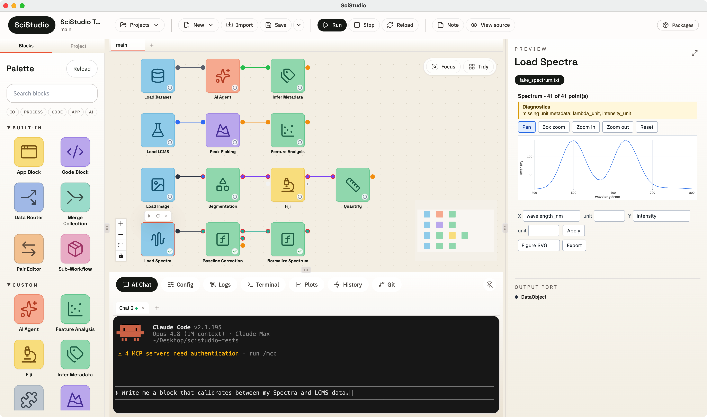

<div align="center">


# SciStudio

**For your great science: every data, every tool, one workflow.**

[]()
[](LICENSE)
[](https://www.python.org/downloads/)
[](https://github.com/jiazhenz026/SciStudio/actions/workflows/ci.yml)
[](https://jiazhenz026.github.io/SciStudio/)
[](https://discord.gg/5b7kTRU2k)

**English** | [简体中文](README.zh-CN.md)

</div>

---

<div align="center">

<!-- Drop the home-page workflow canvas screenshot at docs/assets/scistudio-canvas.png -->


</div>

## What is SciStudio?

SciStudio is an **AI-native workflow runtime for multimodal scientific data**. SciStudio lets researchers connect scientific software, AI agents, scripts and multimodal data into one visual workflow.

- **Every modality, one graph** — imaging, spectroscopy, tables, and files
  share typed data and flow through the same workflow.
- **View your data in your way** - Customize the way you preview your data, customize your figure with plot cards.
- **Bring your existing tools** — run R or Python scripts and
  launch desktop apps like Fiji as ordinary blocks in the flow.
- **AI-native** — a built-in assistant (Claude Code or Codex) helps you build
  workflows, author new blocks, and inspect your data.
- **Extensible** — add your own blocks, data types, and plots, and share them as
  installable packages.

See [architecture doc](https://github.com/jiazhenz026/SciStudio/blob/main/docs/architecture/ARCHITECTURE.md) for detailed philosophy.

## Install

### For users

Download the latest SciStudio desktop app from the
[**Releases page**](https://github.com/jiazhenz026/SciStudio/releases) — a macOS
`.dmg` or a Windows installer. Open it and you're ready; Python and all
dependencies are bundled, so there is nothing else to set up.

Then follow the [**Quickstart**](https://jiazhenz026.github.io/SciStudio/user-guide/getting-started.html).

### For developers (run from source)

```bash
git clone https://github.com/jiazhenz026/SciStudio.git
cd SciStudio

# Python backend (use a conda env or a virtualenv)
python -m pip install ".[dev]"

# Frontend dependencies
npm --prefix frontend install

# Run the desktop app against your source:
# Vite HMR for the frontend + the SciStudio backend + Electron.
npm --prefix desktop run dev
```

Frontend edits hot-reload; restart the command to pick up backend changes. See
[`desktop/README.md`](desktop/README.md) for packaging the app (`.dmg` /
Windows installer).

## Documentation

Full documentation lives at **[jiazhenz026.github.io/SciStudio](https://jiazhenz026.github.io/SciStudio/)**:

- [**User Guide**](https://jiazhenz026.github.io/SciStudio/user-guide/README.html)
  — building and running workflows, previewing data, history and branches, the
  AI assistant, and writing your own blocks, types, and plots.
- [**Quickstart**](https://jiazhenz026.github.io/SciStudio/user-guide/getting-started.html)
  — from a fresh install to your first running workflow.
- [**API Reference**](https://jiazhenz026.github.io/SciStudio/user-guide/api-reference/index.html)
  — the public API you can rely on, with signatures and stability tiers.
- [**Package Development**](https://jiazhenz026.github.io/SciStudio/package-development/index.html)
  — building a distributable SciStudio package (blocks, types, previewers).
- [**Architecture**](docs/architecture/ARCHITECTURE.md) — how SciStudio is built
  and why.

The User Guide and API Reference are the same docs SciStudio provisions into each
project, so what you read online matches what ships with the app.

## Contributing

Contributions are welcome — bug reports, feature ideas, docs, and code. Start by
reading [**CONTRIBUTING.md**](CONTRIBUTING.md), and see [`AGENTS.md`](AGENTS.md)
for the full development workflow (branch, issue, gate, tests, docs, review).

To build and ship your own blocks (rather than change the core), follow the
[Package Development guide](https://jiazhenz026.github.io/SciStudio/package-development/index.html).

## Community

Questions, feedback, and bug reports are very welcome while SciStudio is in alpha:

- [Discord](https://discord.gg/5b7kTRU2k)
- [GitHub Issues](https://github.com/jiazhenz026/SciStudio/issues)

## Status

SciStudio is in **alpha** and under active development. Interfaces and APIs may
change between releases; the [API Reference](https://jiazhenz026.github.io/SciStudio/user-guide/api-reference/index.html)
marks the stability tier of each public symbol.

## License

SciStudio is released under the MIT License. See [LICENSE](LICENSE) for the full
text.
