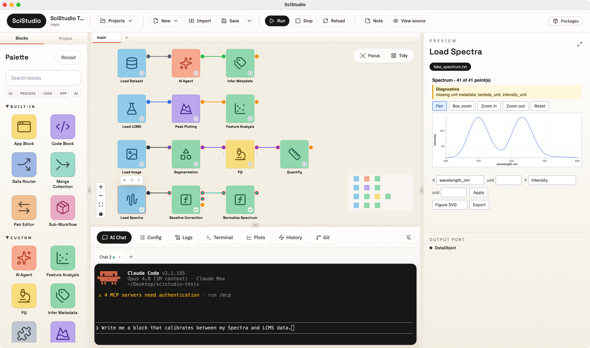

<div align="center">


# SciStudio

**与你的 AI 伙伴一起使用的科研工作流工作台。**

[]()
[](LICENSE)
[](https://www.python.org/downloads/)
[](https://github.com/jiazhenz026/SciStudio/actions/workflows/ci.yml)
[](https://jiazhenz026.github.io/SciStudio/)
[](https://discord.gg/5b7kTRU2k)

[English](README.md) | **简体中文**

</div>

---

<div align="center">

<!-- Drop the home-page workflow canvas screenshot at docs/assets/scistudio-canvas.png -->


</div>

## SciStudio 是什么?

SciStudio 是一套面向多模态科学数据分析的交互式工作流编排系统。你和 AI 伙伴可以在同一张画布上交互协作。
我们以空间多组学为起点，正在逐渐向其他数据模态拓展。SciStudio 让研究者把科研软件、AI 智能体、脚本和多模态数据连接成一条可视化工作流。

- **同一张类型化的图** —— 各区块交换带类型的数据,在同一条工作流中流转,
  让每一步都彼此衔接。
- **按你的方式查看数据** —— 自定义数据预览方式，并通过绘图卡片定制图表。
- **沿用你现有的工具** —— 把 R 或 Python 脚本当作普通区块运行,
  也能像区块一样在流程中启动 Fiji 等桌面应用。
- **AI 原生** —— 内置助手(Claude Code 或 Codex)帮你搭建工作流、编写新区块、
  并检视你的数据。
- **可扩展** —— 添加你自己的区块、数据类型和图表,并以可安装的软件包形式分享出去。

## 安装与使用

### 面向使用者

从 [**Releases 页面**](https://github.com/jiazhenz026/SciStudio/releases) 下载并安装
SciStudio 桌面应用。应用已内置 Python 与运行所需依赖，无需单独安装。

启动 SciStudio 时，选择适合你的使用方式：

- **Desktop（桌面模式）**：在 SciStudio 桌面窗口中使用。
- **External AI（外部 AI 模式）**：如果想在支持 WebMCP 的 AI 桌面应用（如 ChatGPT、Kimi）中使用
  SciStudio，请选择此模式**（Claude 目前不支持）**。待服务启动后，点击连接窗口中的 **Copy**，
  在 AI 应用的内置浏览器中打开复制的地址，即可与 AI 一起使用 SciStudio。使用期间，请保持 SciStudio 在后台运行。

详细使用说明见 [**用户指南**](https://jiazhenz026.github.io/SciStudio/user-guide/)。

### 面向服务器

```bash
pip install scistudio
```

wheel 包内置网页前端。每次桌面版更新也会在 PyPI 发布同一构建：例如，
`0.3.4-alpha-build0029` 对应 `scistudio==0.3.4a29`。发布稳定版后，
可添加 `--pre` 安装最新的 alpha 版本。

### 面向开发者(从源码运行)

```bash
git clone https://github.com/jiazhenz026/SciStudio.git
cd SciStudio

# Python 后端(使用 conda 环境或 virtualenv)
python -m pip install ".[dev]"

# 前端依赖
npm --prefix frontend install

# 以源码运行桌面应用:
# 前端使用 Vite HMR + SciStudio 后端 + Electron。
npm --prefix desktop run dev
```

前端改动会热更新;后端改动需重启该命令才能生效。打包应用(`.dmg` /
Windows 安装包)的说明见 [`desktop/README.md`](desktop/README.md)。

## 文档

完整文档见 **[jiazhenz026.github.io/SciStudio](https://jiazhenz026.github.io/SciStudio/)**:

- [**用户指南**](https://jiazhenz026.github.io/SciStudio/user-guide/)
  —— 搭建与运行工作流、预览数据、历史与分支、AI 助手,以及编写你自己的区块、
  类型和图表。
- [**快速上手**](https://jiazhenz026.github.io/SciStudio/user-guide/getting-started.html)
  —— 从全新安装到跑通第一条工作流。
- [**API 参考**](https://jiazhenz026.github.io/SciStudio/user-guide/api-reference/index.html)
  —— 你可以依赖的公开 API,附带签名与稳定性分级。
- [**软件包开发**](https://jiazhenz026.github.io/SciStudio/package-development/index.html)
  —— 构建可分发的 SciStudio 软件包(区块、类型、预览器)。
- [**架构**](docs/architecture/ARCHITECTURE.md) —— SciStudio 如何构建,以及为何如此设计。

用户指南与 API 参考和 SciStudio 注入到每个项目里的文档是同一套,因此你在线上读到的
内容与随应用一同发布的内容一致。

## 参与贡献

欢迎各种形式的贡献 —— 缺陷报告、功能建议、文档与代码。请先阅读
[**CONTRIBUTING.md**](CONTRIBUTING.md),完整的开发流程(分支、issue、gate、测试、
文档、评审)见 [`AGENTS.md`](AGENTS.md)。

若你想构建并发布自己的区块(而非改动核心),请参阅
[软件包开发指南](https://jiazhenz026.github.io/SciStudio/package-development/index.html)。

## 社区

在 SciStudio 处于 alpha 阶段期间,我们非常欢迎提问、反馈与缺陷报告:

- [Discord](https://discord.gg/5b7kTRU2k)
- [GitHub Issues](https://github.com/jiazhenz026/SciStudio/issues)

## 状态

SciStudio 目前处于 **alpha** 阶段,正在积极开发中。各版本之间接口与 API 可能发生变化;
[API 参考](https://jiazhenz026.github.io/SciStudio/user-guide/api-reference/index.html)
标注了每个公开符号的稳定性分级。

## 许可证

SciStudio 以 Apache License 2.0 发布。完整条款见 [LICENSE](LICENSE)。
