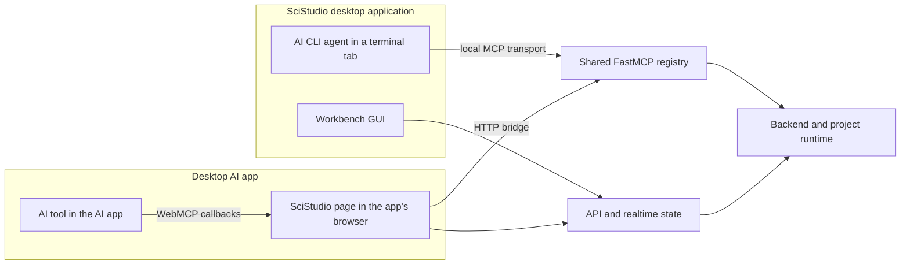

# SciStudio Architecture Document

> Status: Living architecture reference
> Last updated: 2026-09-15
> Audit rule: implementation contracts must match current repository facts

---

## 1. Introduction

### 1.1 Introduction

SciStudio is an interactive workflow orchestration system for multimodal
scientific data analysis. You and your AI partner work together interactively on
the same canvas.

SciStudio is a space in which a researcher and an AI partner create an analysis
together. Scientific analysis unfolds one result at a time. A researcher often
cannot say what the next step should be until the previous result is in front
of them, and once they see the data they want to handle it, try one analysis
and then another, and watch what changes. Code written by an agent and a
pipeline assembled in advance both describe analysis that is already decided.
The part still being discovered needs a place where the researcher works on the
data directly, with the AI partner beside them.

SciStudio therefore gives the shared space two forms of work of equal standing:

- **MiniApps are for exploration and interaction.** A MiniApp is a small
  interactive application, usually written by the AI partner on request, that
  opens on a piece of data. The researcher moves its controls, sees the effect
  at once, and tries analyses while the next step is still unknown.
- **Workflows are for procedure, reuse, and reproduction.** A workflow is a
  typed graph of blocks. It holds the steps that have been settled, runs them
  again on new data, and records how every result was produced.

The two meet as the analysis matures. What an exploration settles on becomes a
step, the AI partner builds that step into the workflow, and the workflow grows
as the researcher learns what the data calls for. A workflow's outputs are in
turn the data the next MiniApp opens on.

Both forms rest on one shared state. The workflow graph, its blocks and
parameters, the data each run produces, the MiniApps, and the views that
present data live in the project and are served by one backend. The researcher
acts on that state through the GUI and the AI partner acts on it through MCP
tools, so each sees what the other has done and can inspect, adjust, and run
it. The rest of the architecture supplies what this space needs:

- **Typed data.** A typed scientific data model describes the shape, storage,
  metadata, and movement of multimodal data, so blocks, MiniApps, and views all
  read the same data the same way.
- **Existing tools.** R and Python scripts and desktop applications such as Fiji
  run as ordinary blocks, so established scientific software joins a workflow
  without being rewritten.
- **Views of data.** Panels let the researcher and the AI partner decide how data
  is previewed and interacted with, and plot cards shape figures.
- **An AI partner in the project.** An AI coding agent running inside the
  application, or an external AI app with WebMCP support, builds workflows, writes blocks and
  MiniApps, and inspects data through the same project it shares with the
  researcher.
- **Extension.** Blocks, data types, panels, MiniApps, and plots can be written
  for one project and shared as installable packages, keeping domain logic out
  of the core runtime.
- **Traceability.** Each workflow run records lineage, and native Git version and
  branch management keeps the project's history reproducible.

### 1.2 Contents

| Section | Topic | Contract source |
|---|---|---|
| 1 | Introduction | Product purpose, document conventions |
| 2 | Scope | The problems SciStudio addresses and what it leaves to other tools |
| 3 | Architecture overview | ADR-025, ADR-026, ADR-038, ADR-039 |
| 4 | Data foundation | ADR-027, ADR-028, ADR-031, ADR-038, ADR-039, ADR-041 |
| 5 | Block system | ADR-020, ADR-025, ADR-026, ADR-027, ADR-028 |
| 6 | Execution engine | ADR-020, ADR-038 |
| 7 | AI Agents | ADR-034, ADR-040 |
| 8 | API | ADR-023, ADR-024, ADR-033 |
| 9 | Frontend | ADR-023, ADR-024, ADR-036 |
| 10 | Panels and MiniApps | ADR-048, ADR-051, ADR-054, ADR-055 |
| 11 | Plot system | ADR-048 |
| 12 | Project workspace structure | ADR-023, ADR-038, ADR-039, ADR-040 |
| 13 | Extensibility | ADR-025, ADR-026, ADR-028 |
| 14 | Desktop app | Electron shell + bundled backend |
| 15 | Dependencies list | Repository dependency manifests |
| 16 | Technology stack summary | Current repository dependencies |

### 1.3 Architecture Index

| Area | Primary responsibility | Expected evidence |
|---|---|---|
| Data foundation | Data object model, storage references, lazy access, lineage, boundary format handling | ADRs, specs, public type contracts, storage tests |
| Block system | Block base behavior, port semantics, registry, package discovery, SDK expectations | ADRs, public block contracts, registry tests |
| Execution engine | Graph scheduling, collection transport, process lifecycle, resource coordination, checkpoint behavior | Runtime modules, engine tests, lineage checks |
| AI Agents | Production agent boundaries, MCP surface, project provisioning, skills, hooks, provider parity | ADRs, API contracts, governance checks |
| API layer | REST, WebSocket, SPA serving, project and workflow orchestration | API modules, route tests, frontend integration checks |
| Frontend | Canvas layout, palette, node UI, preview panels, tab behavior, run controls | Frontend source, UI tests, ADR-backed interaction rules |
| Panels and MiniApps | Panel folders and contexts, sandboxed panel host and SDK, data reads, MiniApps and their Python | ADR-054, panel specs, panel security and routing tests |
| Workspace | Project files, workflow definitions, local runtime state, source history | Workspace docs, ADRs, serialization tests |
| Extension points | Plugin entry points, block packages, custom type packages, developer scaffolding | Specs, entry point contracts, SDK tests |

---

## 2. Scope

### 2.1 Why SciStudio Exists

Scientific data analysis now has two kinds of help, and each lacks what the
other has. Established analysis tools give researchers direct control, rich
interaction, results they can reproduce, and methods they can reuse, yet they
are scattered across modalities and were built before AI. AI assistants can
write analysis, explain results, and suggest the next step, yet their help
arrives without the control, interaction, reproducibility, and reuse the
established tools provide. SciStudio
addresses three problems:

1. Multimodal data analysis tools are scattered and support AI poorly, so
   multimodal workflows and AI work together badly and analysis is slow.
2. AI-assisted data analysis lacks the strengths of the established tools:
   operability, interactivity, reproducibility, and reusability.
3. AI-native applications are moving toward a space in which people and AI
   create together, and scientific data analysis needs such a space to close
   the first two gaps.

### 2.2 Scattered Tools With Poor AI Support

A single study may combine images, tables, spectra, omics matrices, and
measurements from several instruments. Each modality comes with its own tools.
Many of the most trusted are domain-specific GUI applications: Fiji for
microscopy images, instrument vendors' acquisition and processing software,
viewers and annotation tools built for one kind of data. Around them sit domain
libraries in Python and R, command-line programs, and notebooks. Researchers
depend on this ecosystem, and its shape slows them down:

- **Scattered tools.** Analysis steps live in separate applications and
  scripts, and moving data between them is manual work: export from one GUI,
  import into the next, and keep track through file names. The same nominal
  file format means different things to different tools, and large datasets make
  loading and copying whole files between tools expensive.
- **Poor AI support.** Most established tools were designed for a person at a
  mouse and keyboard. A domain GUI application such as Fiji exposes its
  operations through menus, dialogs, and clicks on the image, which an AI
  assistant can neither perform nor observe. A vendor format is opaque to a
  general-purpose model, and a pipeline offers an AI assistant no structured way
  to inspect its steps or change its parameters.
- **Workflows that AI cannot join.** A multimodal workflow spread across these
  tools has no single description an AI assistant can read, run, or modify. The
  assistant sees fragments pasted into a chat, and the researcher carries every
  suggestion back into the tools by hand.
- **Low efficiency.** Each hand-off between tools, and between the researcher
  and the assistant, costs time and introduces errors, and the cost multiplies
  with every modality a study adds.

SciStudio gives these tools one typed data model and one workflow graph that
both the researcher and the AI partner work on. Data inside SciStudio carries an
explicit type, and conversion between file formats happens only where data
enters or leaves. Existing scripts in Python or R run as code blocks, and domain
GUI applications such as Fiji run as app blocks: the workflow hands the
application its input, the researcher works in the familiar window, and the
results return to the workflow as typed data. Established tools join a workflow
as they are, and the AI partner reads, builds, runs, and inspects that workflow
through MCP tools.

### 2.3 AI-Assisted Analysis Without Operability, Interactivity, Reproducibility, Or Reusability

The established tools, for all their fragmentation, give researchers four
things that AI-assisted analysis lacks today:

- **Operability.** In an established tool the researcher acts on the data
  directly. An AI assistant's work arrives as code or text in a chat, and to act
  on it the researcher has to copy it into their own environment, run it, and
  fix what fails. A researcher fluent in science and less fluent in code spends
  their effort on the code.
- **Interactivity.** An established viewer lets the researcher move a
  threshold, select a region, or compare two settings and see the effect at
  once. An AI assistant's result is a static answer, and every change is another
  request and another wait. Exploration, where the next step depends on what the
  last result showed, becomes a slow exchange of messages.
- **Reproducibility.** An established pipeline can be rerun and traced back to
  the parameters that produced each result. An AI assistant's code and
  conclusions stay in a conversation or a scratch file, where the settings behind
  a figure are lost once the conversation moves on.
- **Reusability.** An established tool, once learned, serves every new dataset,
  project, and colleague. An analysis an AI assistant writes is shaped to one
  conversation. The next dataset or the next project starts from another request,
  and nothing the assistant built is kept as a tool others can pick up.

SciStudio places the AI partner's work in the project, where it takes the form
of those tools. What the AI partner builds is a workflow the researcher can run
and edit, a block with typed ports, or a MiniApp the researcher operates
directly on their data. MiniApps restore operability and interactivity during
exploration. Workflows restore reproducibility for the steps that settle,
recording how each result was produced. Reusability comes from keeping what
the AI partner builds as tools: workflows, blocks, and MiniApps stay in the
project under version control, blocks, data types, and MiniApps can be promoted
to the user's library for every project, and packages share them with others.

### 2.4 A Space Where People And AI Create Together

Most applications add AI as an assistant beside the product: a chat that
answers questions about the work, while the work itself stays where it was. As
AI takes on more of the building, the application becomes the place where a
person and AI work on the same thing. SciStudio is designed as that space for
scientific data analysis:

- **One shared state.** Workflows, blocks, parameters, run results, MiniApps,
  and views of data live in the project and are served by one backend. The
  researcher acts through the GUI, the AI partner acts through MCP tools, and
  each sees what the other has done.
- **Two forms of work.** MiniApps serve exploration and interaction. Workflows
  serve procedure, reuse, and reproduction. An exploration that settles becomes
  a workflow step (Section 1.1).
- **The AI partner builds the tools.** The AI partner writes blocks, MiniApps,
  panels, and plots on request, so a researcher obtains a tool fitted to their
  data by describing what they need.
- **Any capable AI.** The AI partner is whichever capable AI the researcher
  chooses. AI coding agents run inside the application against the project, and
  external AI apps connect to a running instance through WebMCP; all of them work
  through the same project tools.

### 2.5 What SciStudio Does Not Provide

SciStudio provides the space and runtime around scientific tools and AI, and
leaves the science to them and to the researcher. It does not try to:

- Replace domain-specific analysis packages, statistical methods, or scientific
  validation.
- Guarantee that an analysis is scientifically correct without human review and
  domain expertise. The researcher remains responsible for scientific judgement,
  including judgement of what the AI partner produces.
- Hide all complexity from advanced users who need custom code, external tools,
  or domain-specific tuning.
- Move domain logic into the core runtime; domain support ships as packages.
- Record exploration as provenance. A MiniApp leaves its page and its code, and
  lineage begins when an exploration becomes a workflow step.
- Make large data cheap by itself; it provides contracts and execution patterns
  that let blocks avoid unnecessary loading and copying.

---

## 3. Architecture Overview

SciStudio is organized around one project state served by one backend, on which
the two forms of work of Section 1.1 run side by side. Workflows run on the
block system and the execution engine. MiniApps, and the panels that present
data, run on the panel system and its runtime. Both read and produce data
through the same data foundation, and both are reached through the same API by
the researcher in the GUI and by the AI partner through MCP tools. The layers
describe these responsibility boundaries; the runtime architecture describes how
the parts cooperate while a researcher and an AI partner build a workflow, run
it, explore its results, and turn what they learn into further steps.

### 3.1 Layer Architecture

The layer model keeps user-facing tools, API orchestration, AI integration, the
two runtimes, and data handling separate. The workflow side and the panel side
share the layers above and below them and stay independent of each other in the
middle. Higher layers depend on lower layers, while plugin and cross-cutting
systems extend or observe the stack without becoming a hidden extra layer.

<table>
  <tbody>
    <tr>
      <td colspan="2" style="text-align:center; padding:10px; border:1px solid #999;"><strong>Layer 6: Frontend</strong><br />Workflow canvas, block palette, run controls, MiniApp tabs, sandboxed panel frames for previews and interactive decisions</td>
    </tr>
    <tr>
      <td colspan="2" style="text-align:center; padding:10px; border:1px solid #999;"><strong>Layer 5: API</strong><br />REST, realtime updates, project and workflow orchestration, panel contexts, reads, and calls, static app serving</td>
    </tr>
    <tr>
      <td colspan="2" style="text-align:center; padding:10px; border:1px solid #999;"><strong>Layer 4: AI Agents</strong><br />Agent runtime, MCP tools for workflows, blocks, panels, and MiniApps, project provisioning, skills, provider parity</td>
    </tr>
    <tr>
      <td style="text-align:center; padding:6px; border:1px solid #999; width:50%;"><em>Workflows: procedure, reuse, reproduction</em></td>
      <td style="text-align:center; padding:6px; border:1px solid #999; width:50%;"><em>MiniApps and panels: exploration and interaction</em></td>
    </tr>
    <tr>
      <td style="text-align:center; padding:10px; border:1px solid #999;"><strong>Layer 3: Execution Engine</strong><br />Event-driven scheduling, process lifecycle, resource coordination, pause/resume, checkpoint behavior</td>
      <td style="text-align:center; padding:10px; border:1px solid #999;"><strong>Panel Runtime</strong><br />Contexts that decide what a panel may do, sandboxed host and SDK channel, bounded reads, resident <code>panel.py</code> processes for MiniApps</td>
    </tr>
    <tr>
      <td style="text-align:center; padding:10px; border:1px solid #999;"><strong>Layer 2: Block System</strong><br />Block lifecycle, ports, validation, CodeBlock, AppBlock, AIBlock, interactive blocks, subworkflows, registry metadata</td>
      <td style="text-align:center; padding:10px; border:1px solid #999;"><strong>Panel System</strong><br />Panel folders and <code>panel.json</code>, contexts, discovery across tiers, routing by data type</td>
    </tr>
    <tr>
      <td colspan="2" style="text-align:center; padding:10px; border:1px solid #999;"><strong>Layer 1: Data Foundation</strong><br />Typed scientific data model, storage references, lazy and windowed access, lineage, canonical-zone boundary handling</td>
    </tr>
    <tr>
      <td style="text-align:center; padding:10px; border:1px solid #999;"><strong>Plugin Ecosystem</strong><br />Domain blocks, data types, panels, MiniApps, file adapters, external-tool bridges, package discovery</td>
      <td style="text-align:center; padding:10px; border:1px solid #999;"><strong>Cross-Cutting Systems</strong><br />Lineage, Git-backed history, governance, audit, permissions, environment capture</td>
    </tr>
  </tbody>
</table>

The block system and execution engine are described in Sections 5 and 6, and the
panel system and its runtime in Section 10. The two sides meet at defined points
(Section 3.2) and share everything else through Layer 1 below them and the API
and frontend above them.

The plugin ecosystem and cross-cutting systems sit on the same conceptual row:
plugins extend what SciStudio can do on either side, while cross-cutting systems
record, govern, or constrain work across all layers. Neither collapses into
frontend state or bypasses the lower runtime contracts.

### 3.2 Runtime Architecture

At runtime, SciStudio is event-driven. The researcher in the frontend and the AI
partner through MCP send their intent to the API, which hands it to one of two
runtimes. Workflow changes and run requests go to the workflow runtime, which
validates the graph against block and data-type contracts and dispatches ready
work through the execution engine. Opening a preview, an interactive decision,
or a MiniApp goes to the panel context service, which decides what the panel
may read and do and serves the page into a sandboxed frame. Both runtimes emit
events that keep the frontend, the AI partner, and the project record
synchronized.

<table>
  <tbody>
    <tr>
      <td style="text-align:center; padding:10px; border:1px solid #999; width:50%;"><strong>Researcher: Frontend</strong><br />Canvas, run controls, MiniApp tabs, panel frames</td>
      <td style="text-align:center; padding:10px; border:1px solid #999; width:50%;"><strong>AI Partner: MCP Clients</strong><br />In-app agents and WebMCP apps building workflows, blocks, panels, MiniApps</td>
    </tr>
    <tr>
      <td colspan="2" style="text-align:center; padding:10px; border:1px solid #999;"><strong>API Boundary</strong><br />Receives user and agent intent; exposes runtime state without becoming the source of truth</td>
    </tr>
    <tr>
      <td style="text-align:center; padding:10px; border:1px solid #999;"><strong>Workflow Runtime</strong><br />Validates graphs, resolves block/type contracts, manages run state, pauses for interactive decisions</td>
      <td style="text-align:center; padding:10px; border:1px solid #999;"><strong>Panel Context Service</strong><br />Opens preview, interactive, and MiniApp contexts; authorizes reads; accepts decisions; routes calls</td>
    </tr>
    <tr>
      <td style="text-align:center; padding:10px; border:1px solid #999;"><strong>Execution Engine And Block Runtime</strong><br />Schedules ready blocks, reserves resources, runs process, IO, Code, App, AI, and interactive blocks</td>
      <td style="text-align:center; padding:10px; border:1px solid #999;"><strong>Panel Frames And Processes</strong><br />Sandboxed pages on one SDK channel; a resident <code>panel.py</code> process for each open MiniApp</td>
    </tr>
    <tr>
      <td style="text-align:center; padding:10px; border:1px solid #999;"><strong>Event Bus</strong><br />Run events, block state changes, progress, logs, interactive pauses, workflow and MiniApp changes</td>
      <td style="text-align:center; padding:10px; border:1px solid #999;"><strong>Registry</strong><br />Discovers blocks, types, panels, MiniApps, adapters, and external-tool bridges across tiers</td>
    </tr>
    <tr>
      <td colspan="2" style="text-align:center; padding:10px; border:1px solid #999;"><strong>Type And Data Runtime</strong><br />Typed objects, storage references, windowed reads, canonical-zone data, import/export boundaries</td>
    </tr>
    <tr>
      <td colspan="2" style="text-align:center; padding:10px; border:1px solid #999;"><strong>Project Record</strong><br />Workflow definitions, block, panel, and MiniApp folders, artifacts, lineage, Git history, environment snapshots, logs</td>
    </tr>
  </tbody>
</table>
On the workflow side, the central coupling is between blocks and data types.
Blocks declare what kind of data they accept and produce, and data types
describe shape, storage, metadata, and access patterns. The execution engine
uses those contracts to validate connections, materialize data at external-tool
boundaries, avoid unnecessary full loads, and persist enough lineage to
reconstruct what happened.

On the panel side, the central coupling is between a panel and its context. A
panel is a folder with a page and, for a MiniApp, its own Python. The context
that opens it decides what it is given, what it may read, and whether it may
write back a decision or call its Python; the panel declares nothing about its
own permissions. The page runs in a sandboxed frame and reaches the backend only
through its host, reading data through the same data foundation in bounded
windows. A MiniApp's `panel.py` runs in a resident subprocess that holds its
data while the MiniApp is open, so the researcher's controls answer at once.
Exploration in a MiniApp records no lineage; lineage begins when a step joins a
workflow.

The two sides meet where the analysis moves between exploration and procedure:

- **Previews.** A preview panel shows a block's output or any data in the
  project, read-only.
- **Interactive decisions.** When a workflow pauses at an interactive block, an
  interactive panel shows the view the block prepared and writes back one
  decision. The engine resumes the block, and the decision is recorded in
  lineage.
- **MiniApps on workflow results.** A MiniApp opens on the output of a block's
  latest successful run.
- **Exploration into procedure.** The AI partner converts a MiniApp into an
  interactive block, so the step an exploration settled on joins the workflow.

The API and frontend are presentation and orchestration surfaces over both
runtimes. They may cache view state for interaction, but workflow truth,
authorization of panel reads, and the project record belong to the backend. The
AI partner uses the same API and MCP-facing capabilities as the researcher's
GUI, so what it builds on either side can be inspected, adjusted, traced, and
reused in the project.

---

## 4. Layer 1: Data Foundation

The **data foundation** is the bottom layer of SciStudio. It gives workflow blocks
a common way to describe **scientific data**, move data between steps, avoid
unnecessary copies, cross **file-format boundaries**, and preserve enough
context to reproduce an analysis later.

### 4.1 Base Types

SciStudio keeps the **core data model** intentionally small. The **base types**
are not a catalog of every scientific modality. They are the common shapes that
many domain types can build on.

#### 4.1.1 DataObject

`DataObject` is the **common wrapper** for data moving through a workflow. It exists
so every block can receive data with a consistent envelope for framework
metadata, user metadata, type information, and storage references.

It normally appears as a lightweight object that points to stored data instead
of carrying the full payload in memory. Examples include an object representing
a table persisted in Parquet, an image stack persisted in Zarr, or a file-backed
artifact produced by an external tool.

#### 4.1.2 Array

`Array` represents **N-dimensional numeric data with named axes**. It exists
because scientific imaging, spectra, volumes, time series, and other dense
measurements need axis-aware slicing and iteration rather than anonymous
positional indexing.

An `Array` records shape, dtype, axes, chunking expectations, and storage
reference information. Examples include microscopy images, volumetric stacks,
hyperspectral cubes, matrix-like measurements, and other dense numeric payloads.

#### 4.1.3 Series

`Series` represents **one-dimensional labelled data**. It exists for values that
are naturally ordered or indexed but do not need the full table model.

A `Series` may be used for spectra, traces, measurements over time, calibration
curves, or other single-axis scientific values.

#### 4.1.4 DataFrame

`DataFrame` represents **tabular data**. It exists because many scientific
results are row-and-column records: observations, features, peaks, measurements,
sample metadata, quality-control tables, and summary outputs.

A `DataFrame` records columns, schema, row count, and a storage reference to a
columnar backend when data is persisted.

#### 4.1.5 Text

`Text` represents **small textual payloads**. It exists for prompts, notes, logs,
plain text outputs, structured text snippets, and other small content that is
better carried directly than stored as a large data object.

Unlike large scientific arrays or tables, a `Text` object may keep its content
in memory because it is expected to be small.

#### 4.1.6 Artifact

`Artifact` represents **files whose internal format is not part of the SciStudio
canonical data model**. It exists for interoperability with scientific tools
that produce reports, images, PDFs, archives, logs, or other file outputs.

An `Artifact` usually preserves the original file and carries descriptive
metadata, MIME information, and a file path or storage reference.

#### 4.1.7 CompositeData

`CompositeData` represents a **named bundle of heterogeneous data objects**. It
exists because many real scientific objects are containers rather than a single
array or table.

A composite object may bundle a matrix, feature table, observation metadata,
images, coordinate tables, masks, annotations, or other related data slots while
keeping the bundle addressable as one workflow value.

### 4.2 Type Hierarchy

The **type hierarchy** lets SciStudio validate workflow connections at the level
of scientific meaning without forcing every modality into the core package.

**Core types** provide broad categories. **Plugin packages** define
domain-specific types by building on those categories. A workflow port can
accept a broad type when it only needs generic behavior, or a narrower
plugin-provided type when the block requires domain-specific structure.

This separation keeps core stable while allowing new domains to extend SciStudio
with their own types. The core does not need to know every image, spectrum,
omics, or instrument-specific class in advance. It only needs the registered
type relationship and the contracts needed for validation, preview, storage,
and execution.

Examples:

- **`Image` -> `Array`**: image data specializes the dense named-axis array
  model.
- **`FluorImage` -> `Image`**: fluorescence image data specializes image data
  with channel-aware metadata and axis requirements.
- **`Spectrum` -> `Series`**: spectrum data specializes one-dimensional labelled
  values.
- **`PeakTable` -> `DataFrame`**: peak tables specialize row-and-column
  scientific results.
- **single-cell data / spatial-omics data -> `CompositeData`**: multimodal
  containers specialize named bundles of heterogeneous data slots.

### 4.3 Data Management

#### 4.3.1 Storage Backends

SciStudio stores data in **backends chosen for the access pattern** of each base
type. The goal is to keep workflow values **lightweight** while allowing blocks
to load only the data they actually need.

| Base type | Primary backend | Rationale |
|---|---|---|
| `Array` | Zarr | Chunked, compressed, cloud-compatible storage for large numeric data. |
| `Series` | Apache Arrow / Parquet | Columnar storage for indexed one-dimensional values while preserving label/value schema. |
| `DataFrame` | Apache Arrow / Parquet | Columnar storage for filtering, aggregation, and memory mapping. |
| `Text` | In memory or filesystem | Small textual payloads can usually travel directly. |
| `Artifact` | Filesystem | Original files are preserved for interoperability. |
| `CompositeData` | Directory of slot backends | Each slot uses the backend appropriate to its own type. |

`Series` storage is table-shaped even when the logical value is one-dimensional.
Generic `Series` values normally persist as a one-column Arrow table named by
`value_name`; domain-specific `Series` subclasses may use additional columns
when their type contract requires explicit coordinates, such as `Spectrum`
storing `lambda` and `intensity`.

#### 4.3.2 Canonical Zone And Boundary Formats

SciStudio separates **internal workflow data** from **external file formats**.
Inside the workflow, data moves through a **canonical zone**: arrays, tables,
text, artifacts, and composite objects use explicit typed contracts and storage
references. File extensions and external formats are not used as the internal
compatibility model.

**Format handling happens at boundaries:**

- Load boundaries convert user files into canonical typed data.
- Save boundaries convert canonical typed data into user-requested output
  formats.
- AppBlock and CodeBlock boundaries materialize canonical inputs for external
  tools or scripts, then reconstruct declared outputs back into canonical typed
  data.
- AIBlock boundaries follow the same model when an agent workflow needs file
  exchange.

```text
+--------------------+     +--------------------+
| User files         |     | User outputs       |
| instrument formats |     | requested formats  |
+---------+----------+     +----------+---------+
          |                           ^
          v                           |
+---------+----------+     +----------+---------+
| Load boundary      |     | Save boundary      |
| selected capability|     | selected capability|
+---------+----------+     +----------+---------+
          |                           ^
          v                           |
+---------+---------------------------+---------+
| Canonical zone                               |
| typed data objects + storage references      |
| format is not an internal edge contract      |
+---------+---------------------------+---------+
          ^                           ^
          |                           |
+---------+---------------------------+---------+
| External-tool boundaries                     |
| AppBlock / CodeBlock / AIBlock               |
| materialize inputs, reconstruct outputs      |
+------------------------------------------------+
```

This model avoids treating **file extensions as data contracts**. A filename may
be useful for humans, but the replayable decision is the selected **boundary
capability**: the declared direction, target type, format identity, extensions,
handler, priority/default metadata, and fidelity expectations.

Within the **canonical zone**, blocks connect by type and declared data
contract. When a user needs a different file format, SciStudio models that as an
explicit **boundary conversion** rather than a hidden edge between ordinary
processing blocks.

#### 4.3.3 Lazy Loading, Slicing, And Broadcast

SciStudio avoids loading **large datasets** until a block asks for data. Data
objects can point to persisted storage and expose methods for **full
materialization**, **partial reads**, and **chunked iteration**.

**Lazy loading** has three practical effects:

- Large arrays and tables can move through the workflow as references.
- Blocks can process slices or chunks instead of copying entire datasets.
- External-tool boundaries can materialize only the files needed for that tool.

**Named axes** make slicing and broadcast meaningful for scientific data. A
block can operate over spatial axes while iterating over time, depth, channel,
or spectral dimensions. **Broadcast helpers** support cross-modal patterns where
a lower-dimensional object is applied across a higher-dimensional target, while
the block remains responsible for the scientific validity of the operation.

### 4.4 Metadata Management

ADR-043 uses metadata management in a narrow IO-boundary sense. It governs how
external file metadata is represented, declared, validated, and surfaced when
data crosses between SciStudio's canonical zone and files, scripts, notebooks, or
external applications.

The central rule is that **DataObject types do not own file formats**. Format
knowledge belongs to IO capabilities. A `FormatCapability` describes one
boundary conversion with a **direction**, **data type**, **format id**,
**extensions**, **label**, **owning block type**, **handler**, **default or
priority**, optional **round-trip group**, and a **metadata fidelity** contract.

`MetadataFidelity` records what domain metadata survives that conversion:

| Fidelity level | Meaning |
|---|---|
| `pixel_only` | Preserves only the primary payload and minimum structural fields needed to build the target object. |
| `typed_meta` | Preserves declared fields from the target type's typed `meta` model. |
| `format_specific` | Preserves declared format-native metadata through typed fields, a typed sidecar, or a package-defined metadata object. |
| `lossless` | Preserves the declared boundary representation for a compatible round-trip group. |

This metadata is validated at registry scan time. The registry checks that
handlers exist, extensions are normalized, capability IDs are stable, defaults
do not conflict, round-trip claims have compatible load/save sides, and
declared typed `meta` fields exist on the target type's metadata model.

AppBlock and CodeBlock boundary ports use this same model. An extension remains
a filename and UI hint, but the selected **`capability_id`** is the stable IO
selection for replay and validation when multiple packages can handle the same
type and extension.

Run IDs, block execution rows, resolved configs, environment snapshots, and
input/output object edges are **Lineage**, not ADR-043 metadata management.
Free-form user metadata is also outside ADR-043 and belongs to a future
metadata package.

### 4.5 Data Lineage

SciStudio records workflow execution as **lineage** rather than treating outputs
as isolated files. A run record connects the workflow definition, source state,
resolved block parameters, block executions, inputs, outputs, environment
information, and termination state.

**Lineage is separate from content storage.** Intermediate outputs may be
managed by their natural storage backends and may be overwritten by later runs.
The durable asset is the **recipe**: which workflow ran, with which parameters,
against which inputs, in which environment, and from which source state.

This lets SciStudio answer questions such as:

- Which workflow produced this result?
- Which blocks ran and which were skipped, cancelled, or failed?
- Which parameters and inputs were used?
- Which source version was executed?
- What should be re-run to reproduce or inspect the result?

The lineage store is `<project>/.scistudio/lineage.db`, a SQLite database using
WAL mode for project-local concurrent writes. ADR-038 defines four normalized
tables:

| Table | What it records |
|---|---|
| `runs` | One workflow execution, including workflow id, source commit, workflow snapshot, status, trigger, parent run, execute-from block, and environment snapshot. |
| `block_executions` | One row per block execution in a run, including block id, block type, block version, resolved config, timing, duration, and terminal status. |
| `data_objects` | DataObject identity and reference payloads, including type name, backend, best-effort storage path, size, mtime, wire payload, derivation, and producer execution. |
| `block_io` | Port-to-object edges for each execution, including direction, port name, object id, and collection position. |

Worker subprocesses do not write to `lineage.db`. The engine process observes
block inputs and outputs, reads their wire-format references, and records the
lineage rows externally. This keeps block authoring unchanged while making run
history queryable.

Collections are stored as item-level lineage edges rather than as one opaque
row. A collection output with many items becomes many `data_objects` rows plus
ordered `block_io.position` entries, so the UI can reconstruct the collection
shape without storing the collection wrapper as a separate database object.

Each run also records an environment snapshot. The snapshot captures the Python
version, platform, full package freeze, and derived key packages so re-run
checks can warn when the current environment has drifted from the historical
run.

**Re-runs** create new lineage records linked back to the earlier run. That
makes reproducibility visible as a chain of attempts rather than an overwrite of
history.

### 4.6 Version Control

Every SciStudio project can be managed as a **Git-backed project**. Workflow
files, custom block code, notes, and project configuration can be committed,
compared, restored, branched, and merged using ordinary version-control
semantics.

**Git history** and **run lineage** solve different problems:

- Git records changes to source files, workflow definitions, custom code, and
  project notes.
- Lineage records executions, parameters, inputs, outputs, environment context,
  and run status.

The connection between them is the **source state captured for a run**. From a
run, a user can recover the workflow source that was executed. From a source
state, a user can inspect which runs used it.

Branches are also useful for scientific analysis itself, not only software
development. Scientists often adapt nearly identical pipelines for different
batches, instruments, cohorts, or experiments. A branch can represent one
parallel workflow variant for one data context. Users can switch quickly between
branches, compare what changed, and keep each adapted workflow recoverable. In
this usage, branches are primarily a way to manage parallel analysis variants;
merging is optional and often not the main goal.

Project runtime state and **large data** are not automatically treated as Git
content. They are managed through storage and lineage. This keeps Git useful for
human-readable project history and parallel workflow variants while avoiding
large binary churn in ordinary commits.

---

## 5. Layer 2: Block System

A **Block** is the unit of work in a SciStudio workflow. It wraps one analysis
step behind a typed contract: what it accepts, what it produces, how it is
configured, and how the runtime should execute it. Blocks can represent pure
computation, data loading and saving, external applications, project-local
scripts, AI agents, or nested workflows.

### 5.1 Base Class Definition

The `Block` base class defines the common contract shared by every block. The
full implementation contains validation details and helper methods; the public
surface below is the architecture-level contract.

```python
from abc import ABC, abstractmethod
from typing import Any, ClassVar

from scistudio.blocks.base.config import BlockConfig
from scistudio.blocks.base.ports import InputPort, OutputPort
from scistudio.blocks.base.state import ExecutionMode
from scistudio.core.types.collection import Collection

class Block(ABC):
    name: ClassVar[str] = "Unnamed Block"
    description: ClassVar[str] = ""
    version: ClassVar[str] = "0.1.0"
    subcategory: ClassVar[str] = ""

    input_ports: ClassVar[list[InputPort]] = []
    output_ports: ClassVar[list[OutputPort]] = []

    variadic_inputs: ClassVar[bool] = False
    variadic_outputs: ClassVar[bool] = False
    allowed_input_types: ClassVar[list[type]] = []
    allowed_output_types: ClassVar[list[type]] = []

    min_input_ports: ClassVar[int | None] = None
    max_input_ports: ClassVar[int | None] = None
    min_output_ports: ClassVar[int | None] = None
    max_output_ports: ClassVar[int | None] = None

    dynamic_ports: ClassVar[dict[str, Any] | None] = None
    execution_mode: ClassVar[ExecutionMode] = ExecutionMode.AUTO
    terminate_grace_sec: ClassVar[float] = 5.0
    key_dependencies: ClassVar[list[str]] = []
    config_schema: ClassVar[dict[str, Any]] = {"type": "object", "properties": {}}

    def get_effective_input_ports(self) -> list[InputPort]: ...
    def get_effective_output_ports(self) -> list[OutputPort]: ...
    def validate(self, inputs: dict[str, Any]) -> bool: ...

    @abstractmethod
    def run(
        self,
        inputs: dict[str, Collection],
        config: BlockConfig,
    ) -> dict[str, Collection]: ...

    def postprocess(
        self,
        outputs: dict[str, Collection],
    ) -> dict[str, Collection]: ...
```

Important class attributes:

- **`name` / `description` / `version`** identify the block in the palette and
  in lineage records.
- **`input_ports` / `output_ports`** declare the static typed interface.
- **`variadic_inputs` / `variadic_outputs`** allow a block instance to expose a
  user-edited port list.
- **`allowed_input_types` / `allowed_output_types`** constrain port-editor type
  choices for variadic blocks.
- **`dynamic_ports`** describes enum-driven port changes such as load/save
  blocks whose selected data type changes the effective port type.
- **`execution_mode`** tells the runtime whether the block is automatic,
  interactive, or external.
- **`terminate_grace_sec`** gives the runtime a cancellation grace period before
  forced termination.
- **`config_schema`** drives the configuration form exposed through the API and
  frontend.

### 5.2 State Machine

Every block moves through a small state machine during a workflow run. The
state machine is owned by the engine — `DAGScheduler` is the authoritative
source per ADR-018 §8.1 (`DAGScheduler.set_state` / `block_states()`). Worker
subprocesses do not carry their own block-state field; cancellation from
inside `run()` surfaces as the typed `BlockCancelledByAppError` exception, which
the worker forwards via the `final_state` envelope (#1334). Terminal states
describe the result of one execution attempt; returning to `IDLE` happens
when the workflow is reset for another run.

```text
IDLE      -> READY | SKIPPED | ERROR
READY     -> RUNNING | SKIPPED | ERROR
RUNNING   -> DONE | PAUSED | ERROR | CANCELLED
PAUSED    -> RUNNING | ERROR | CANCELLED
DONE      -> IDLE
ERROR     -> IDLE
CANCELLED -> IDLE
SKIPPED   -> IDLE
```

```text
+------+      +-------+      +---------+      +------+
| IDLE | ---> | READY | ---> | RUNNING | ---> | DONE |
+--+---+      +---+---+      +----+----+      +--+---+
   |              |               |              |
   |              |               v              |
   |              |          +----+----+         |
   |              |          | PAUSED  | --------+
   |              |          +----+----+
   |              |               |
   v              v               v
+--+---+      +---+---+      +----+-----+
|ERROR |      |SKIPPED|      |CANCELLED |
+--+---+      +---+---+      +----+-----+
   |              |               |
   +--------------+---------------+
                  |
                  v
                +----+
                |IDLE|
                +----+
```

#### 5.2.1 IDLE

`IDLE` means the block is not part of an active execution attempt. A reset
places completed, failed, cancelled, or skipped blocks back into this state.

#### 5.2.2 READY

`READY` means all required upstream inputs are available and the scheduler may
dispatch the block.

#### 5.2.3 RUNNING

`RUNNING` means the block has been dispatched and is actively executing or
waiting inside its worker process.

#### 5.2.4 PAUSED

`PAUSED` means execution is intentionally suspended while waiting for an
external action, such as a GUI application, human review, or agent completion.

#### 5.2.5 DONE

`DONE` means the block completed successfully and produced its declared outputs.

#### 5.2.6 ERROR

`ERROR` means the block failed because validation, runtime execution, external
process handling, or output reconstruction failed.

#### 5.2.7 CANCELLED

`CANCELLED` means the user or runtime explicitly terminated the block before it
completed.

#### 5.2.8 SKIPPED

`SKIPPED` means the block could not run because required upstream output was not
available. Skip propagation lets the workflow finish with a clear causal chain
instead of hiding the downstream effects of an earlier failure.

### 5.3 Subprocess Isolation

Subprocess isolation is the **default execution path for non-interactive
blocks**. For these blocks, block logic runs outside the engine process. The
engine remains an orchestrator: it validates workflow state, starts workers,
records transitions, handles cancellation, and collects outputs. The worker
process reconstructs typed inputs from references, executes the block, and
returns typed outputs.

Subprocess isolation provides three guarantees for **every** block, interactive
or not:

- **Reliable cancellation**: the runtime can terminate a block without killing
  the engine.
- **Crash isolation**: a crash, memory leak, or native-library failure is
  contained to the worker or external process.
- **Low data-copy overhead**: large payloads stay in storage; cross-process
  exchange carries references and metadata rather than full data whenever
  possible.

#### 5.3.1 Interactive blocks run as two subprocess phases

Interactive blocks (for example `DataRouter` and `PairEditor`, identified by
`execution_mode == ExecutionMode.INTERACTIVE` plus the `InteractiveMixin`
capability) are **not** an exception to subprocess isolation. Since ADR-051 they
run as **two worker-subprocess phases around an engine-held pause**, so a block
is only ever executing inside a subprocess that runs to completion, never while
a human is in the loop.

The flow is: a **prompt phase** worker runs `prepare_prompt(inputs, config)` to
build a JSON-safe, window-sized view of the data and exits; the engine
transitions the block to `PAUSED` and holds the wait with **nothing resident**,
emitting an `INTERACTIVE_PROMPT` event (carrying the block's panel manifest and
the panel payload) over the WebSocket; when the user confirms, a fresh
**compute phase** worker runs `run(inputs, config)` with the decision merged
into config and exits. Heavy intermediate work may cross the pause as
engine-held storage references (never through the browser), and the user's
decision is recorded in lineage through `block_config_resolved` (ADR-038).

Because no block code is resident during the pause, the crash-isolation and
cancellation guarantees above apply to interactive blocks too: cancelling a
paused interaction releases any intermediate scratch and starts no compute
phase. See `scistudio/engine/scheduler/_dispatch.py` (`_run_interactive`),
`scistudio/engine/runners/worker.py` (the phase marker), and
`scistudio/blocks/base/interactive.py` (the capability) for the implementation.

### 5.4 Core Block Classes

The core block classes define common execution shapes. Domain packages and
project-local custom blocks build on these shapes instead of inventing their own
workflow runtime.

#### 5.4.1 IOBlock

`IOBlock` handles **data ingress and egress**. Loader blocks convert external
files into canonical typed data. Saver blocks convert canonical typed data into
user-requested external formats.

Important class attributes include **`direction`**, **`supported_extensions`**,
**`format_capabilities`**, static or dynamic ports, and format-related config
schema. `IOBlock` is where file format capability metadata attaches to block
execution.

#### 5.4.2 ProcessBlock

`ProcessBlock` is the normal class for deterministic data transformations. It
is used for algorithms that consume typed inputs and produce typed outputs.

Important class attributes include **`input_ports`**, **`output_ports`**,
**`algorithm`**, **`subcategory`**, and **`config_schema`**. Block authors can
implement per-item processing for simple cases or override full run behavior for
custom batching, streaming, or multi-port logic.

#### 5.4.3 Custom Block

**Custom Block** is a user-facing concept rather than a separate required base
class in the current runtime. A custom block is a project-local or user-global
block file that subclasses one of the core block classes and is discovered by
the registry.

Custom blocks usually declare **`name`**, **`description`**, **`version`**,
**`input_ports`**, **`output_ports`**, **`config_schema`**, and optional
**`subcategory`**. They let a lab add local logic without publishing a package.

#### 5.4.4 AppBlock

`AppBlock` bridges external GUI or CLI applications through file exchange. It
materializes canonical inputs for the tool, launches or coordinates the tool,
watches for declared outputs, and reconstructs those outputs into canonical
typed data.

Important class attributes include **`app_command`**, **`output_patterns`**,
**`variadic_inputs`**, **`variadic_outputs`**, **`input_ports`**,
**`output_ports`**, and **`config_schema`**. `AppBlock` usually runs in external
mode and may enter `PAUSED` while waiting for user or tool output.

#### 5.4.5 CodeBlock

`CodeBlock` runs project-local scripts through the same external-boundary model
as app integration. Conceptually, it is part of the **AppBlock-shaped boundary
family**: canonical inputs are materialized for a script, the script runs in a
resolved backend, and declared outputs are reconstructed. In the current code,
`CodeBlock` directly subclasses `Block` while sharing the AppBlock-style
boundary behavior.

Important class attributes include **`input_ports`**, **`output_ports`**,
**`variadic_inputs`**, **`variadic_outputs`**, and script/backend configuration
schema. `CodeBlock` is for existing scripts and notebooks, not for moving
plugin logic into core.

Supported script suffixes are defined by the registered CodeBlock backends:

| Backend | Supported suffixes |
|---|---|
| Python script | `.py` |
| Shell script | `.sh` |
| R / Quarto script | `.R`, `.Rmd`, `.qmd` |
| Notebook | `.ipynb` |
| MATLAB-family script | `.m`, `.mlx` |

#### 5.4.6 AIBlock

`AIBlock` runs an AI agent as a workflow node. It presents declared inputs to
the agent, waits for completion, and validates declared outputs before the
workflow continues. Conceptually, it is also part of the **AppBlock-shaped
boundary family**: it crosses from canonical workflow data into an external
agent session and back. In the current code, `AIBlock` directly subclasses
`Block` while sharing this boundary behavior.

Important class attributes include **`type_name`**, **`name`**,
**`description`**, **`subcategory`**, **`input_ports`**, **`output_ports`**,
**`variadic_inputs`**, **`variadic_outputs`**, and agent/provider configuration
schema.

#### 5.4.7 SubWorkflowBlock

`SubWorkflowBlock` lets an entire workflow be referenced as a single node
inside another workflow. It is the **composition and canvas-readability**
mechanism: it collapses a reusable sub-pipeline into one node so large graphs
stay legible, and a workflow authored once can be reused across many parents.

It is an **authoring-time container, not a runtime executor** — the defining
design decision. A `SubWorkflowBlock` node carries only a reference to an
external subworkflow file (**`config.ref.path`**) and owns no child scheduler.
At run start, a parser-layer flattener
(`WorkflowDefinition.flatten_subworkflows`) replaces every `SubWorkflowBlock`
node with a prefixed copy of the referenced subworkflow's blocks and edges
before scheduler dispatch. The execution engine therefore always receives a
flat DAG and never observes a `SubWorkflowBlock` at runtime. This is why the
design flattens at the parser layer rather than nesting executors: it keeps
subworkflows out of the scheduler entirely and reuses the existing
single-graph execution path.

The editor keeps the container intact so authoring and storage stay stable.
Per-node port handles and dangling-edge detection come from the
**dynamic-ports** mechanism, deriving ports from the referenced subworkflow's
**`exposed_ports`** rather than from whole-graph flattening, and
double-clicking the canvas node opens the referenced file in its own editor
tab. When a reference cannot be resolved the editor renders a broken-reference
placeholder (a `subworkflow_broken` node) so the rest of the canvas still
loads, and run start rejects any unresolved reference rather than dispatching
it. Because the lineage record's `workflow_yaml_snapshot` captures the
flattened YAML, past runs stay reproducible automatically; reproducibility of
a reference against future edits is delegated to git branches or tags rather
than embedded in the tool.

Important class attributes include **`config.ref.path`** (the referenced
subworkflow file), dynamic port derivation from the referenced subworkflow's
**`exposed_ports`**, and the standard **`input_ports`** / **`output_ports`**
surface shared with other blocks. The full contract is defined by ADR-044
(`docs/adr/ADR-044.md`) and its implementation spec
(`docs/specs/adr-044-subworkflow-block.md`).

### 5.5 Port System

Ports define where data can enter or leave a block. They are the visible
connection points in the frontend and the runtime contract used by validation
and scheduling.

#### 5.5.1 Static Ports

Static ports are declared on the block class. They are appropriate when the
block always has the same input and output shape, such as one image in and one
image out.

Each static port declares a **name**, **accepted types**, **required/default
behavior**, and optional human-readable description.

#### 5.5.2 Variadic Ports

Variadic ports are edited per block instance. They are appropriate for blocks
where users choose the number or type of inputs and outputs at workflow design
time, such as AppBlock, CodeBlock, AIBlock, or routing blocks.

Variadic behavior is controlled by **`variadic_inputs`**,
**`variadic_outputs`**, **`allowed_input_types`**, **`allowed_output_types`**,
and optional min/max port-count constraints. Effective port methods convert the
instance configuration into the port list consumed by validation and execution.

#### 5.5.3 Port Validation

Port validation happens in layers:

- **Design-time validation** rejects impossible connections in the frontend.
- **Workflow validation** checks graph structure and port compatibility before
  execution.
- **Block validation** checks required inputs, accepted types, port constraints,
  and variadic port limits for the specific block instance.

---

## 6. Layer 3: Execution Engine

The execution engine turns a validated workflow graph into coordinated runtime
work. It owns graph scheduling, event propagation, subprocess dispatch,
checkpoint updates, resource gating, data transport, and terminal-state
handling. It does not own scientific algorithms; those live inside blocks.

### 6.1 Engine Responsibilities And Scope

The engine is responsible for moving a workflow from **requested** to
**completed, failed, cancelled, or partially skipped** while preserving enough
state for the UI, API, lineage system, and checkpoint system to agree on what
happened.

In scope:

- Build and execute a typed DAG from the workflow definition.
- Track block state transitions and emit runtime events.
- Dispatch blocks through a `BlockRunner`, normally `LocalRunner`.
- Coordinate subprocess lifecycle through `ProcessHandle` and
  `ProcessRegistry`.
- Apply resource gating through `ResourceManager` before starting work.
- Preserve pause/resume and latest-run checkpoint state through
  `CheckpointManager` and `WorkflowCheckpoint`.
- Move data between blocks as `Collection` transport units.
- Surface block-level terminal outcomes to API, frontend, lineage, and audit
  surfaces.

Out of scope:

- Scientific correctness of a block's algorithm.
- Per-item retry policy inside a collection. That belongs to the block.
- Hidden conversion between file formats on ordinary workflow edges.
- Long-term run provenance storage. The engine emits and observes events, but
  durable run history belongs to the lineage layer in Section 4.5.

The engine therefore acts as the runtime coordinator. It keeps orchestration
explicit while letting blocks, data types, lineage, and UI components keep their
own responsibilities.

### 6.2 Event Bus

`EventBus` is the runtime publish/subscribe backbone defined by ADR-018.
Schedulers, resource managers, process monitors, checkpoint handlers, lineage
recorders, WebSocket handlers, and API surfaces coordinate by emitting and
subscribing to `EngineEvent` values.

Core mechanisms:

| Mechanism | Responsibility |
|---|---|
| `EngineEvent` | Carries event type, optional block id, payload data, and timestamp. |
| `EventBus.subscribe` | Registers sync or async callbacks for one event type. |
| `EventBus.emit` | Broadcasts an event to subscribers, awaits async callbacks, and isolates callback failures. |
| `EventBus.unsubscribe` | Removes a callback from an event type. |

Important runtime event families:

| Event family | Examples | Main use |
|---|---|---|
| Workflow lifecycle | `WORKFLOW_STARTED`, `WORKFLOW_COMPLETED` | Run-level UI/API updates and completion handling. |
| Block lifecycle | `BLOCK_READY`, `BLOCK_RUNNING`, `BLOCK_PAUSED`, `BLOCK_DONE`, `BLOCK_ERROR`, `BLOCK_CANCELLED`, `BLOCK_SKIPPED` | State propagation, downstream scheduling, checkpointing, lineage writes. |
| Cancellation requests | `CANCEL_BLOCK_REQUEST`, `CANCEL_WORKFLOW_REQUEST` | User/API initiated cancellation routed to the scheduler and process layer. |
| Process lifecycle | `PROCESS_SPAWNED` | Register active process handles for lookup and cancellation. |
| Checkpointing | `CHECKPOINT_SAVED` | Notify UI and runtime surfaces that latest-run state was persisted. |
| Interactive workflow | `INTERACTIVE_PROMPT`, `INTERACTIVE_COMPLETE` | Bridge human/tool interaction for blocks that pause for input. |
| Project change | `WORKFLOW_CHANGED`, `GIT_HEAD_CHANGED` | Invalidate cached workflow or Git views after source changes. |

Event handling is deliberately resilient. One subscriber failure is logged and
isolated; it must not prevent later subscribers from receiving the same event.
This keeps a WebSocket push failure from blocking resource release, checkpoint
updates, or scheduler progress.

The main subscriber pattern is:

| Subscriber | Typical events consumed | Result |
|---|---|---|
| `DAGScheduler` | Block terminal events and cancellation requests | Dispatch successors, cancel running work, or mark downstream blocks skipped. |
| `ResourceManager` | Terminal block events | Release GPU and CPU allocations. |
| `ProcessRegistry` | Process spawn and cancellation requests | Track active handles and terminate requested processes. |
| `CheckpointManager` | Terminal block events | Writes latest-run checkpoint state. |
| Lineage recorder | Terminal block events and run lifecycle context | Writes durable run, block, object, and port-edge records. |
| WebSocket/API handlers | Workflow and block state events | Push runtime status to clients. |

### 6.3 DAG Scheduler

`DAGScheduler` executes the workflow graph. It treats each workflow node as a
block execution unit and each edge as a typed dependency. A block can run only
after required upstream outputs are available and the resource manager allows
dispatch.

Scheduler responsibilities:

- Build an execution order from the DAG.
- Initialize block states and move ready nodes into `READY`.
- Dispatch ready blocks by creating independent async tasks.
- Await block completion through the runner result path.
- Store block outputs for downstream inputs.
- Emit terminal events for done, error, cancelled, or skipped blocks.
- Retry ready-but-resource-blocked nodes after resources are released.
- Propagate `SKIPPED` to downstream nodes whose required inputs can no longer be
  produced.

The concurrency model is event-driven. Dispatch does not wait inline for a
subprocess to finish; it starts a task and returns control to the event loop.
Independent DAG branches can therefore run in parallel, while blocks with data
dependencies still wait for their predecessors.

Cancellation also flows through the scheduler. A block cancellation request asks
the process layer to terminate the active process, moves the block to
`CANCELLED`, emits the terminal event, and marks unreachable downstream blocks
as `SKIPPED`. Workflow cancellation repeats the same pattern for every active or
pending block.

### 6.4 Checkpointing And Resource Management

The engine keeps two runtime control systems close to scheduling: latest-run
checkpointing and resource gating. Both are deliberately operational; neither is
the durable lineage record described in Section 4.5.

`CheckpointManager` saves the latest known workflow state after terminal block
events. `WorkflowCheckpoint` records block states, intermediate references,
pending block information, config snapshot, and skip reasons. The checkpoint
lives under `<project>/.scistudio/pause/` and is a **latest-run recovery artifact**.
It supports pause/resume, crash recovery, and run-from-here on the latest
available intermediate state.

A checkpoint is not a historical run database. Once newer runs overwrite
intermediate outputs, older intermediate states are not guaranteed to be
loadable from the checkpoint. Historical reproducibility comes from the lineage
recipe plus re-execution, not from storing every intermediate payload forever.

`ResourceManager` gates dispatch before a block starts. It tracks discrete GPU
slots and CPU worker budget, and it checks current system memory before allowing
new subprocesses to launch. Resource release happens from terminal events and
process-exit events.

The resource model has three layers:

| Layer | Responsibility |
|---|---|
| Dispatch gating | `ResourceManager` decides whether a block may start based on GPU, CPU, and memory state. |
| Block-local memory behavior | Collection helpers, lazy loading, and block logic decide how much data is loaded at once. |
| OS/process fallback | If a subprocess crashes or is killed by the OS, the runner observes the non-zero exit and the scheduler marks the block failed. |

Blocks declare resource needs through resource request metadata. The scheduler
uses those declarations as an admission-control signal, not as proof that a
scientific method is safe or efficient.

### 6.5 Process Lifecycle Management

SciStudio runs blocks in isolated subprocesses per ADR-017 and ADR-019. The goal
is simple: a block can crash, be cancelled, or exhaust memory without taking
down the engine process.

The process lifecycle components are:

| Component | Role |
|---|---|
| `BlockRunner` | Abstract runner interface used by the scheduler. |
| `LocalRunner` | Default runner that executes blocks as local subprocesses. |
| `RunHandle` | Scheduler-level handle for a running block, including process and result tracking. |
| `ProcessHandle` | Cross-platform abstraction for observing, terminating, and killing one process tree. |
| `ProcessRegistry` | Registry of active process handles, used for lookup, cancellation, and shutdown. |

All subprocess creation goes through the process lifecycle layer. On POSIX
systems, child processes are grouped so termination can reach the process tree.
On Windows, the implementation uses the platform process primitives needed to
terminate the launched process tree. Platform details stay behind
`ProcessHandle`; the scheduler only asks for cancellation or observes terminal
state.

The worker-to-engine result path uses a stdout envelope. A successful worker
returns serialized outputs and environment information. A worker can also report
a non-DONE terminal state through the terminal-state path, which `LocalRunner`
turns into `BlockTerminalStateReportedError` so the scheduler finalizes the
block as cancelled, errored, or skipped instead of treating empty output as a
successful run.

### 6.6 Data Flow And Collection Management

All inter-block values move as `Collection` transport units from ADR-020. A
single object is represented as a length-one collection; multiple objects are a
longer homogeneous collection. `Collection` is not a base data type. Its type
identity for ports comes from the item type.

Engine-level rules:

- The scheduler schedules block nodes, not collection items.
- The engine treats each collection as an opaque transport unit.
- Port validation compares the collection item type with the port's accepted
  data types.
- Worker serialization preserves the collection envelope across subprocess
  boundaries.
- Checkpoint and lineage paths preserve collection structure through ordered
  item references.

Block-level rules:

- A block decides whether to process one item, iterate over many items, or treat
  the whole collection as a unit.
- Per-item error strategy belongs inside the block.
- Memory safety comes from lazy loading, chunking, item-wise flushing, and block
  helper utilities.
- CodeBlock may present collections to user scripts as native single objects or
  lazy iterable lists so users do not need to handle framework internals.

Collection utility blocks such as merge, split, filter, and slice operate at the
workflow level. They make collection structure explicit in the graph instead of
hiding batching behavior inside the scheduler.

### 6.7 Error Management

The engine reports errors at block and workflow boundaries. It does not try to
interpret scientific partial failure inside a collection unless the block
chooses to expose that failure as an output or terminal state.

Main error classes:

| Error class | Engine behavior |
|---|---|
| Block exception | Mark block `ERROR`, emit `BLOCK_ERROR`, release resources, checkpoint, and skip unreachable downstream blocks. |
| User cancellation | Mark block or workflow `CANCELLED`, terminate active processes, emit cancellation events, and skip dependent work. |
| Missing required upstream output | Mark downstream block `SKIPPED` with a skip reason. |
| Subprocess crash or OS kill | The runner observes the non-zero subprocess exit, marks the block `ERROR`, and propagates skip where needed. |
| Subscriber failure | `EventBus` logs and isolates the callback failure so other subscribers still run. |
| Block-reported terminal state | `LocalRunner` converts the worker report into scheduler-visible terminal handling. |

For collection processing, partial success is a block contract. A robust block
may catch per-item failures, emit a smaller collection, or return a structured
artifact describing rejected items. A block that crashes before returning loses
that block's in-process partial work, while already-flushed outputs and the
latest checkpoint remain available according to their normal storage rules.

This error model keeps the runtime predictable: the engine owns block-level
state, process cleanup, skip propagation, and event delivery; blocks own domain
recovery choices.

---

## 7. Layer 4: AI Agents

Layer 4 is how the AI partner joins the researcher in a SciStudio project. An AI
can work with SciStudio in two forms. It can run as an AI CLI agent inside the
SciStudio desktop application, or it can keep working inside the researcher's
desktop AI app and collaborate with SciStudio through WebMCP. In both forms the
AI acts on the same project, through the same MCP tool registry, on SciStudio's
normal workflow, data, lineage, and project-management rails.

ADR-040 governs the in-app agent and ADR-055 the WebMCP collaboration. Both
treat agent reliability as a project-level stack: project instructions, task
skills, FastMCP-backed tools, project context, provider configuration, and
deterministic hooks where the host supports them.

### 7.1 Two Ways AI Works With The Researcher



| Aspect | AI CLI agent in SciStudio | AI app through WebMCP |
|---|---|---|
| Where the AI runs | A provider's CLI agent spawned in a terminal tab of the SciStudio desktop application, in the project root | The researcher's desktop AI app, which keeps its own conversation, models, and other tools |
| How the researcher starts it | Choose **Desktop** at launch and open an agent tab | Choose **External AI** at launch, copy the address, and open it in the AI app's built-in browser |
| How it reaches SciStudio | The project-local MCP transport (§7.5) | WebMCP callbacks registered by the SciStudio page, forwarded to the backend's HTTP bridge (§7.4) |
| What the researcher sees | The full workbench, with the agent in the bottom panel | The AI-host presentation of the same workbench inside the AI app |
| How it learns the project | Provisioned instructions, skills, and hooks discovered by the provider in the project root, plus a composed project prompt | `get_agent_context`, which returns the same project guidance and an index of the provisioned documents and skills |
| What it can additionally do | Use the provider's own file and shell tools in the project root, and capture the desktop workspace or a MiniApp with `screenshot_gui` | Use external-audience workspace and command tools that give it file and process access beside the backend; screenshots are unavailable because the host accepts text only |

The two forms differ only in where the AI lives and how it reaches SciStudio.
Beneath that they are one system: every tool call dispatches through the same
FastMCP registry to the same backend and project runtime, and every change
reaches the GUI through the same API and realtime events. The researcher and the
AI partner therefore see one project whichever form the AI uses, and the
workflow runtime, validation, artifacts, and lineage stay SciStudio's in both.

The in-app form suits a researcher who wants a coding agent working directly in
the project beside the canvas. The WebMCP form suits a researcher who already
works in an AI app and wants SciStudio to join that conversation next to the
app's other scientific tools, such as literature search or protein design.

### 7.2 Production Agent Boundary


ADR-040 separates two environments that must not be confused:

| Environment | Meaning | Governed here? |
|---|---|---|
| Development environment | The SciStudio source repository used by framework contributors. | No. Contributor agents follow repository AI developer rules, gate records, ADR workflow, and source-repo policy. |
| Production environment | A user's SciStudio project workspace opened through the GUI, created by `scistudio init`, or reached by an AI app through WebMCP. | Yes. This layer governs the agent that helps the user build, run, inspect, and maintain project workflows. |

Production agents work in the user's project root. Their job is to help with
scientific workflow authoring, custom block creation, run debugging, data
inspection, and project questions. They should use SciStudio semantic surfaces for
workflow and data operations instead of bypassing the GUI and runtime through
ad hoc shell commands.

This boundary matters because production agents and development agents need very
different instructions. A production agent should understand workflows, blocks,
data refs, lineage, and project files. It should not inherit the full SciStudio
source-repository contributor process.

### 7.3 AI CLI Agents In The Desktop Application

The GUI opens agent sessions as PTY-backed terminal tabs inside the active
project. Each supported AI CLI is described by one entry in the provider
registry (`scistudio.ai.agent.providers_registry`), and launch code stays thin
and uniform across providers. A provider entry records:

| Field | What it decides |
|---|---|
| Binary | Which executable is launched, in the project root. |
| MCP injection | How the CLI learns about the SciStudio MCP server: a spawn flag naming `<project>/.scistudio/mcp.json`, command-line configuration overrides, or a SciStudio entry merged into the provider's own project-scope config file. |
| Prompt injection | Whether the composed project prompt is passed through a file-reading flag or discovered ambiently from the provisioned instructions and skills. |
| Credential probe | How login state is detected, so SciStudio can report whether the agent is ready. |
| Permission modes | Which of Manual, Auto, and Yolo/Bypass the CLI supports and the flags that select them. |

A new AI CLI joins SciStudio by adding a provider entry, without a new launch
path. A plain terminal is registered the same way as a provider with no MCP
wiring.

The PTY model keeps the upstream CLI responsible for the agent loop,
authentication, transcript behavior, and provider-native UX. SciStudio is
responsible for project anchoring, MCP availability, project context, and the
files that steer provider behavior.

Agent sessions are separate from workflow execution. The agent can author or
modify workflow definitions, inspect runs, create custom blocks, or participate
in an AIBlock, while the workflow runtime remains the source of execution
truth. When an agent starts a workflow run, observes outputs, or updates block
config, those actions flow through the same backend, registry, lineage, and Git
surfaces as the researcher's own actions.

### 7.4 AI Apps Through WebMCP

WebMCP lets a web page offer tools to the AI running in the browser that shows
it. Desktop AI apps with a built-in browser and WebMCP support can therefore use
SciStudio's tools from inside their own conversation. SciStudio exposes its MCP
registry this way through a bridge (ADR-055):

1. The researcher chooses **External AI** at launch. SciStudio starts its
   backend as a background service, waits until it is ready, and shows a
   copyable local address. Closing the connection window or the AI app's
   browser does not stop the service or an active analysis; the researcher
   stops it explicitly.
2. The researcher opens the address in the AI app's browser. The address selects
   the AI-host presentation (`?ui=ai`), which fits the workbench into the app's
   narrower browser pane.
3. The SciStudio page fetches the tool catalogue from `GET /api/webmcp/tools` and
   registers each tool with the host's WebMCP API, tolerating hosts that lack
   the API, partial registration failures, and reconnects.
4. When the AI calls a tool, the page forwards it to `POST /api/webmcp/call`. The
   backend dispatches the call through the same FastMCP registry the local
   transport uses and returns structured results, content, and errors through a
   defined adapter.

Bridge calls authenticate with a per-launch session token delivered through the
served page, so another local page cannot call the bridge. Each call names the
project the caller believes is active, and a write whose project selection is
stale is refused, so opening another page cannot redirect an in-flight write to
another project. Calls are logged by operation and outcome, never with their
full arguments.

An AI app does not read the project's provisioned files on its own the way an
in-app CLI does, so the bridge adds tools for what it would otherwise lack. They
carry an external-audience tag, which keeps them in the bridge catalogue and out
of the local transport's tool list:

| Area | MCP tool | Purpose | Access |
|---|---|---|---|
| Context | <code>mcp&#95;&#95;scistudio&#95;&#95;get_agent_context</code> | Start here: the project's instructions, an index of provisioned documents and skills with readable paths, the execution environment, and hook guidance (§7.8). | Read |
| Workspace | <code>mcp&#95;&#95;scistudio&#95;&#95;list_directory</code> | List a directory beside the backend: names, types, sizes, and modification times. | Read |
| Workspace | <code>mcp&#95;&#95;scistudio&#95;&#95;get_file_info</code> | Return metadata for one path: existence, type, size, modification time, readability. | Read |
| Workspace | <code>mcp&#95;&#95;scistudio&#95;&#95;search_files</code> | Find files by name, and optionally by content, below a directory. | Read |
| Workspace | <code>mcp&#95;&#95;scistudio&#95;&#95;read_file</code> | Read a bounded byte range of a file as UTF-8 text or base64. | Read |
| Workspace | <code>mcp&#95;&#95;scistudio&#95;&#95;write_file</code> | Create or replace a text file in the active project, with UI sync. | Write |
| Workspace | <code>mcp&#95;&#95;scistudio&#95;&#95;patch_file</code> | Replace exact text in an existing project file, with UI sync. | Write |
| Workspace | <code>mcp&#95;&#95;scistudio&#95;&#95;create_directory</code> | Create a directory in the active project, outside `data/`. | Write |
| Workspace | <code>mcp&#95;&#95;scistudio&#95;&#95;move_path</code> | Rename or move a file or directory inside the active project, with UI sync. | Write |
| Workspace | <code>mcp&#95;&#95;scistudio&#95;&#95;delete_path</code> | Delete a file or directory in the active project, with UI sync. | Write |
| Commands | <code>mcp&#95;&#95;scistudio&#95;&#95;run_command</code> | Run a shell command in the active project as a managed job, with the bundled Python and the user's dependencies. | Write |
| Commands | <code>mcp&#95;&#95;scistudio&#95;&#95;get_command_status</code> | Report a managed command's state, exit code, and output tails. | Read |
| Commands | <code>mcp&#95;&#95;scistudio&#95;&#95;list_commands</code> | List the managed commands this backend knows about. | Read |
| Commands | <code>mcp&#95;&#95;scistudio&#95;&#95;cancel_command</code> | Stop a managed command and every process it started. | Write |

The workspace write tools refuse any mutation of `workflows/*.yaml` and anything
under `data/`, so workflow and data changes still go through the workflow tools
and runs. A command started by `run_command` runs with the user's ordinary
permissions and is not checked against those file rules (ADR-055 §5.3).

AI apps that run local MCP servers but offer no WebMCP can use the same bridge
through `scistudio webmcp-adapter`, a stdio MCP server that forwards tool
listing and calls to the two bridge routes with the same catalogue, adapter, and
project binding. It adds no second registry and no new server transport.

### 7.5 MCP Tool Surface


The MCP surface is the agent's semantic interface to SciStudio. ADR-040 moves this
surface to a FastMCP-backed implementation so schemas, descriptions, and return
models are generated from typed tool definitions rather than hand-written loose
JSON-RPC descriptions.

The MCP layer is used for operations that need SciStudio semantics:

- discovering blocks and data types;
- reading, validating, and writing workflow definitions;
- starting, cancelling, or inspecting runs;
- scaffolding and reloading custom blocks;
- inspecting data references, previews, and lineage;
- reading project-aware documentation or project state.

MCP is served by the running SciStudio backend. During FastAPI startup, the API
process creates the FastMCP-backed `MCPServer`, installs a project-aware runtime
context, and binds a project-local transport. On POSIX systems this transport is
a Unix socket under the active project's `.scistudio/` directory. On Windows it is
a loopback TCP listener, with the chosen port written beside the project-local
socket sentinel so bridge processes can discover it.

No AI imports SciStudio internals directly. Every caller reaches the same
registry through one of these paths:

| Caller | How it reaches the MCP server |
|---|---|
| In-app AI CLI agent | The provider's MCP injection (§7.3) points the CLI at `scistudio mcp-bridge`, which forwards MCP traffic over the project-local transport to the backend server. |
| AI app with WebMCP | The SciStudio page registers the catalogue with the host and forwards calls to the HTTP bridge (§7.4). |
| AI app with local MCP only | `scistudio webmcp-adapter` forwards stdio MCP calls to the same HTTP bridge (§7.4). |
| Standalone bridge | When no live backend socket is available, `scistudio mcp-bridge` can build a minimal project-scoped MCP runtime for read-oriented tooling, while backend-dependent run control reports that the SciStudio backend must be running. |

Tool handlers receive the same project root, block registry, type registry, run
state, and event bus context that the backend uses. This is why MCP calls can
validate workflows, reload blocks, start runs, inspect lineage, and reflect live
runtime state instead of operating as disconnected file edits.

The production MCP surface contains 53 tools. The 39 tools below are visible on
every path; the 14 external-audience workspace, command, and context tools of
§7.4 are visible only through the WebMCP bridge. One tool below,
`screenshot_gui`, returns an image of the desktop application and works only
over the local transport; through the bridge it reports that the transport is
unsupported, since a WebMCP host accepts text results.

| Area | MCP tool | Purpose | Access |
|---|---|---|---|
| Workflow | <code>mcp&#95;&#95;scistudio&#95;&#95;list_blocks</code> | List registered blocks as a lean catalog (name, category, package, one-line I/O signature); fetch a block's full schema via <code>get_block_schema</code>. | Read |
| Workflow | <code>mcp&#95;&#95;scistudio&#95;&#95;get_block_schema</code> | Return one block type's I/O ports and config schema. | Read |
| Workflow | <code>mcp&#95;&#95;scistudio&#95;&#95;list_types</code> | Return the full data-type registry hierarchy. | Read |
| Workflow | <code>mcp&#95;&#95;scistudio&#95;&#95;get_workflow</code> | Load a workflow YAML and return its decoded representation. | Read |
| Workflow | <code>mcp&#95;&#95;scistudio&#95;&#95;validate_workflow</code> | Validate a workflow, inline YAML or a path, against runtime rules. | Read |
| Workflow | <code>mcp&#95;&#95;scistudio&#95;&#95;write_workflow</code> | Persist a workflow YAML with a file lock and pre-write schema validation (whole-file write; use to create a new workflow). | Write |
| Workflow | <code>mcp&#95;&#95;scistudio&#95;&#95;edit_workflow</code> | Surgically edit part of an existing workflow via schema-validated search/replace patches, preserving untouched config and comments. | Write |
| Workflow | <code>mcp&#95;&#95;scistudio&#95;&#95;run_workflow</code> | Submit a workflow for execution and return its run identifier. | Write |
| Workflow | <code>mcp&#95;&#95;scistudio&#95;&#95;cancel_run</code> | Request cancellation of an in-flight workflow run. | Write |
| Workflow | <code>mcp&#95;&#95;scistudio&#95;&#95;get_run_status</code> | Return the current status of a workflow run. | Read |
| Workflow | <code>mcp&#95;&#95;scistudio&#95;&#95;finish_ai_block</code> | Signal the active AI Block that all declared outputs have been written. | Write |
| Workflow | <code>mcp&#95;&#95;scistudio&#95;&#95;get_active_workflow_context</code> | Return the workflow id the GUI editor currently has open (ADR-040 Addendum 5). | Read |
| Authoring | <code>mcp&#95;&#95;scistudio&#95;&#95;read_block_source</code> | Return the Python source file backing a registered block type. | Read |
| Authoring | <code>mcp&#95;&#95;scistudio&#95;&#95;list_block_examples</code> | List curated example blocks for a category. | Read |
| Authoring | <code>mcp&#95;&#95;scistudio&#95;&#95;scaffold_block</code> | Write a starter block module for the chosen base class under <code>blocks/</code>. | Write |
| Authoring | <code>mcp&#95;&#95;scistudio&#95;&#95;reload_blocks</code> | Hot-reload the block and data-type registries. | Write |
| Authoring | <code>mcp&#95;&#95;scistudio&#95;&#95;run_block_tests</code> | Run pytest against the test module associated with a block. | Write |
| Library | <code>mcp&#95;&#95;scistudio&#95;&#95;promote_to_user_library</code> | Move a project-local block into the user library so every project can use it. | Write |
| Inspection | <code>mcp&#95;&#95;scistudio&#95;&#95;get_block_output</code> | Resolve the recorded output of one block port from a run. | Read |
| Inspection | <code>mcp&#95;&#95;scistudio&#95;&#95;inspect_data</code> | Return metadata about a stored data reference without its payload. | Read |
| Inspection | <code>mcp&#95;&#95;scistudio&#95;&#95;preview_data</code> | Compute a canonical bounded preview of stored data. | Read |
| Inspection | <code>mcp&#95;&#95;scistudio&#95;&#95;get_lineage</code> | Return the transitive lineage ancestors of a data reference. | Read |
| Inspection | <code>mcp&#95;&#95;scistudio&#95;&#95;get_block_config</code> | Return the static configuration of one block in a workflow file. | Read |
| Inspection | <code>mcp&#95;&#95;scistudio&#95;&#95;update_block_config</code> | Patch one block's configuration in a workflow YAML, preserving comments. | Write |
| Inspection | <code>mcp&#95;&#95;scistudio&#95;&#95;get_block_logs</code> | Return captured output from a block's execution. | Read |
| Plot | <code>mcp&#95;&#95;scistudio&#95;&#95;list_plot_targets</code> | List workflow outputs a plot can bind to (node id + output port). | Read |
| Plot | <code>mcp&#95;&#95;scistudio&#95;&#95;list_plot_examples</code> | List curated render-script examples. | Read |
| Plot | <code>mcp&#95;&#95;scistudio&#95;&#95;scaffold_plot</code> | Scaffold a plot manifest and render script bound to a workflow output. | Write |
| Plot | <code>mcp&#95;&#95;scistudio&#95;&#95;read_plot_source</code> | Read a plot's manifest and render script. | Read |
| Plot | <code>mcp&#95;&#95;scistudio&#95;&#95;validate_plot</code> | Validate a plot manifest and its script. | Read |
| Plot | <code>mcp&#95;&#95;scistudio&#95;&#95;run_plot_job</code> | Run a plot job preview-side and write display-only artifacts. | Write |
| Panels | <code>mcp&#95;&#95;scistudio&#95;&#95;validate_panel</code> | Check one panel or MiniApp directory the way discovery checks it and return its diagnostics, without running the page. | Read |
| Panels | <code>mcp&#95;&#95;scistudio&#95;&#95;open_miniapp</code> | Ask the open workspace to open a MiniApp tab on a block output. | Write |
| Panels | <code>mcp&#95;&#95;scistudio&#95;&#95;screenshot_gui</code> | Capture the rendered desktop workspace or the visible MiniApp as an image, with its observed state. Local transport only. | Read |
| Project QA | <code>mcp&#95;&#95;scistudio&#95;&#95;search_docs</code> | Search the project directory's Markdown, reStructuredText, and text files. | Read |
| Project QA | <code>mcp&#95;&#95;scistudio&#95;&#95;get_doc</code> | Return the full text of one documentation file in the project directory. | Read |
| Project QA | <code>mcp&#95;&#95;scistudio&#95;&#95;list_data</code> | Enumerate data assets in the project workspace. | Read |
| Project QA | <code>mcp&#95;&#95;scistudio&#95;&#95;get_project_info</code> | Return high-level information about the active project workspace. | Read |
| Project QA | <code>mcp&#95;&#95;scistudio&#95;&#95;open_gui</code> | Return a URL for the researcher's current project view, for use with browser or computer-use tools. | Read |

The important architectural rule is not the exact tool list. The rule is that
agent actions touching **blocks**, **workflows**, **runs**, **data**, or
**lineage** should go through MCP-backed SciStudio contracts. Generic file reading
can remain provider-native, but direct edits to workflow YAML or shelling out to
alternate runtime paths bypass validation, GUI refresh, and lineage expectations.

Tool results may include next-step guidance and warnings. This creates a local
feedback loop: after a write-like action, the agent is nudged toward validation,
status polling, reload, or type correction without requiring another global
prompt rewrite.

### 7.6 Project Context And Skills

Agent behavior is shaped at session start by project-aware context. The composed
prompt can include project facts such as project name, project root, available
workflows, installed plugins, Git state, and recently modified workflow files.
This makes the agent aware of the actual project instead of operating from a
static generic SciStudio prompt.

ADR-040 also replaces a monolithic skill file with task-scoped skills. The base
SciStudio skill acts as a compact index, while task skills provide detailed
instructions only when relevant.

| Skill area | Use |
|---|---|
| Base skill | Index of the task skills and the rules that apply to every task. |
| Workflow building | Turn a user's analysis intent into a valid workflow graph. |
| Custom block authoring | Reuse existing blocks first, then scaffold new project-specific blocks when needed. |
| Run debugging | Inspect failed or cancelled runs and suggest concrete repairs. |
| Data inspection | Explore data references, previews, lineage, and output meaning. |
| Plot authoring | Write plot cards that render figures from workflow outputs. |
| Panel authoring | Write preview panels and interactive decision panels. |
| MiniApp authoring | Build interactive MiniApps for exploring data with visible feedback. |
| GUI use | Operate and observe the running SciStudio GUI through browser or computer-use tools. |
| Project QA | Answer questions about project structure, files, configuration, and documentation. |

Skills are packaged with SciStudio so wheel installs can provision them reliably.
Project provisioning writes each provider's skill tree so every in-app agent
discovers the same task guidance, and `get_agent_context` indexes the same
skills for an AI app through WebMCP.

### 7.7 Project Provisioning

Production agent reliability is installed into the user's project, not into the
SciStudio source repository. Project creation and project opening perform an
idempotent provisioning pass.

Provisioned assets include:

| Asset | Purpose |
|---|---|
| `CLAUDE.md`, `AGENTS.md` | Project-level instructions, read by the CLIs that discover each file. |
| `.claude/skills/`, `.agents/skills/` | SciStudio task skills in the skill trees the providers discover. |
| `.claude/hooks/` | The seven hook scripts of §7.8, shared by every provider that runs hooks. |
| `.claude/settings.json` | Hook configuration for Claude Code. |
| `.qoder/settings.json` | Hook configuration for both Qoder CLI channels. |
| `.codex/config.toml` | Project-scope Codex MCP entry and hook configuration. |
| `.scistudio/agent-reference/` | Agent reference documents, including installed packages' references. |
| `user-guide/` | The SciStudio user guide and API reference. |

Provisioning is non-fatal and conservative. Missing assets are created; existing
user-edited files are not silently overwritten. This lets older projects receive
the reliability stack while preserving user customizations.

The same asset model is also available through install commands for power users
who want to configure user-scope or project-scope provider assets manually.

### 7.8 Hooks And Guardrails

Hooks are a defense-in-depth layer for production projects. They do not replace
MCP schemas, skills, or human review; they catch known drift patterns at the
moment an AI attempts a risky action. SciStudio ships seven hook scripts:

| Hook | Trigger | Behavior |
|---|---|---|
| `deny_scistudio_cli` | Before a shell command | Blocks shell calls to the `scistudio` CLI and names the MCP tool to use. |
| `protect_workflow_yaml` | Before a file edit or write | Blocks direct edits to `workflows/*.yaml`, which go through the workflow tools. |
| `protect_data_dir` | Before a file edit, write, or shell command | Blocks direct edits and deletes under `data/`, which runs produce. |
| `enforce_list_blocks_before_block_write` | Before a file write, shell command, or `scaffold_block` | Requires `list_blocks` before a new `blocks/*.py` file is authored. |
| `mark_list_blocks_called` | After `list_blocks` | Records that block discovery ran. |
| `enforce_concrete_port_types` | After a file write or `scaffold_block` | Warns about generic `DataObject` or empty accepted-type ports. |
| `remind_poll_status` | After `run_workflow` | Reminds the agent to poll `get_run_status`. |

**In-app AI CLI agents.** Provisioning writes the scripts once to
`.claude/hooks/` and declares them in each provider's project-scope
configuration, with commands that invoke the Python running SciStudio:

| Provider | Where the hooks are declared | How they take effect |
|---|---|---|
| Claude Code | `.claude/settings.json` | Loaded directly when the CLI starts in the project. |
| Qoder CLI (both channels) | `.qoder/settings.json` | Loaded directly; the same settings shape as Claude Code with Qoder's project variable. |
| Codex | `.codex/config.toml`, with hooks enabled under `[features]` | Codex asks the user to trust project hooks before running them. SciStudio leaves that review to the user and does not bypass it. |
| Kimi Code | Not provisioned | Kimi Code reads hooks only from its user-scope configuration, and SciStudio does not write user-scope CLI configuration that would fire in unrelated projects. The setup screen discloses the gap. |

**AI apps through WebMCP.** Nothing is installed into an AI app, and an AI app
does not execute the provisioned scripts. The scripts run only inside a local
CLI session that loads the project's hook configuration, and SciStudio cannot
observe whether any host ran them. The server therefore enforces the rules
itself on the tools a WebMCP AI uses, and `get_agent_context` reports each hook
with its execution location and its server-side equivalent:

| Hook | Server-side equivalent for WebMCP calls |
|---|---|
| `deny_scistudio_cli` | `run_command` refuses commands that invoke the `scistudio` CLI, including through common launchers and shell wrappers. |
| `protect_workflow_yaml` | Workspace write tools refuse any mutation whose source or target is `workflows/*.yaml`. |
| `protect_data_dir` | Workspace write tools refuse any mutation under `data/`. Backend runtime writes are unaffected, and `run_command` is not checked. |
| `enforce_list_blocks_before_block_write` | Workspace writes to `blocks/*.py` and `scaffold_block` through the bridge are refused until `list_blocks` has run in this backend's lifetime. |
| `mark_list_blocks_called` | `list_blocks` records the call server-side, from any transport. |
| `enforce_concrete_port_types` | Workspace writes to `blocks/*.py` return the same warnings in the result. |
| `remind_poll_status` | `run_workflow` results carry a poll hint. |

A command run through `run_command` has the user's ordinary permissions, so the
file rules above are guidance for it and not containment (ADR-055 §5.3).

### 7.9 Parity Across Providers And Forms

Every supported AI CLI is a first-class production-agent provider, and an AI app
through WebMCP is a first-class collaborator. Providers and hosts discover
guidance differently, so SciStudio delivers the same substance through each one's
own mechanism instead of assuming one provider's files govern another.

Parity principles:

- Every in-app provider gets project-level instructions, SciStudio task skills,
  and MCP configuration for the active project, and runs inside the project
  root.
- An AI app through WebMCP gets the same guidance and skill index through
  `get_agent_context` and reaches the same tools through the bridge, except
  `screenshot_gui`, whose image result a WebMCP host cannot accept.
- Every AI, in either form, is expected to use SciStudio semantic operations for
  workflows, blocks, panels, runs, and data.

The implementation details differ by provider: some receive explicit MCP and
prompt arguments at spawn time, others rely on project-scope configuration and
standard discovery files (§7.3). The architectural contract is that a fresh
SciStudio project requires no manual wiring before an in-app agent can help, and
that an AI app needs only the address SciStudio shows at launch.

### 7.10 AIBlock Relationship

`AIBlock` is still a workflow block, not the whole agent layer. It lets an agent
participate as a node in a workflow graph, with declared inputs, declared
outputs, and workflow-visible terminal state. That makes AI participation
composable with ordinary blocks rather than a separate side channel.

The distinction is:

| Surface | Role |
|---|---|
| Agent tab | Interactive project assistant for editing, inspecting, debugging, and explaining. |
| AIBlock | Workflow node that invokes an agent-like step as part of a run. |
| MCP layer | Shared semantic tool surface used by agents to interact with SciStudio safely. |
| Runtime engine | Source of truth for execution state, events, checkpoints, and lineage. |

An example AIBlock use is **experiment metadata extraction from filenames**.
A workflow may load a collection of microscopy image artifacts whose filenames
encode experiment structure, such as treatment group, sample id, replicate id,
time point, or imaging channel. An AIBlock can receive the file references and a
prompt such as:

> Infer experiment metadata from the input filenames. Produce a CSV table with
> columns `file`, `group`, `sample`, `replicate`, `timepoint`, `channel`, and
> `confidence`. Flag ambiguous names instead of guessing silently.

The block declares one input collection and one output table artifact. During
execution, the engine writes an AIBlock run manifest containing the block name,
per-port inputs, expected output paths, declared output types, the user prompt,
and the completion contract. The spawned agent reads that manifest, writes the
CSV to the declared output path, then calls the AIBlock completion MCP tool so the workflow can continue.

The AIBlock agent differs from a normal agent tab:

| Aspect | Normal agent tab | AIBlock agent |
|---|---|---|
| Trigger | User opens or talks to a chat tab. | Workflow execution reaches an AIBlock node. |
| Scope | Open-ended project assistance. | One declared block task with typed inputs and outputs. |
| Context | Project prompt, project context, skills, MCP, and user conversation. | Same production agent context plus an AIBlock manifest and initial task message. |
| I/O contract | No declared workflow ports. | Input and output ports are part of the workflow graph. |
| Completion | User and agent decide when the conversation is done. | Agent must produce declared outputs and signal completion. |
| Failure handling | Conversation error or user-visible failed action. | Block becomes `ERROR`, `CANCELLED`, or `SKIPPED` according to runtime rules. |

In the current implementation, the AIBlock does not replace the production
agent system prompt with a separate provider prompt. It reuses the same
project-aware prompt and MCP configuration where the provider supports them,
then adds AIBlock-specific runtime context through the initial message and
manifest. Functionally, that manifest acts as the extra block-scoped instruction
layer: it tells the agent where inputs are, what outputs are expected, what the
deadline is, and how to finish the block.

This keeps AI-native behavior inside the same architecture as the rest of
SciStudio. Agents can help build and improve workflows, and agents can also appear
inside workflows, but neither case bypasses block contracts, data contracts,
lineage, or project governance.

---

## 8. Layer 5: API

### 8.1 API Role And Scope

The **API layer** is the entry point used by the frontend, agents, and external
clients to reach the SciStudio runtime. It presents project, workflow, block,
data, run, and agent operations through stable service boundaries.

The API layer does **not** own workflow truth. Workflow structure, execution
state, type validation, lineage, and artifact records remain runtime-owned. The
API layer also does **not** perform scientific computation or replace the
engine. It validates requests, calls runtime services, serializes responses, and
streams runtime events to clients.

### 8.2 REST Resources

REST resources are organized by domain instead of by a long endpoint list:

| Resource domain | Responsibility |
|---|---|
| **Projects** | Opens, creates, lists, and updates project workspaces and project-scoped files. |
| **Workflows** | Reads and mutates workflow definitions while preserving backend validation as the source of truth. |
| **Blocks** | Exposes the block registry, block schemas, templates, and connection validation. |
| **Data previews** | Provides lightweight, type-aware previews and metadata for data objects without loading full artifacts into the frontend. |
| **Runs** | Lists recorded runs, exposes run details, and starts runtime-approved rerun flows from recorded state. |
| **Agent status and permissions** | Reports provider availability, terminal-agent status, and pending human approval decisions. |

These resources are **facades over runtime contracts**. A REST response may be
formatted for the frontend, but the underlying meaning comes from workflow,
block, data, run, and permission schemas owned by the backend.

### 8.3 Realtime Updates

Realtime channels use **WebSocket** and streaming responses to keep clients in
sync with runtime activity. They carry block state, run progress, interactive
prompts, workflow changes, Git-head changes, logs, and agent-terminal updates.
The WebSocket protocol also supports an application-level `ping` -> `pong`
heartbeat so the browser can detect an OPEN-but-stale socket and reconnect.

The event source is the backend **EventBus** and runtime services. The frontend
does not infer execution state locally, manufacture block transitions, or treat
its cached view as authoritative. When the frontend receives a realtime update,
it reconciles its display with backend-emitted events.

### 8.4 Agent-Facing MCP

**MCP** is the agent-facing API. **REST** and **WebSocket** are primarily
frontend-facing APIs. Both surfaces share the same backend runtime context:
project root, block registry, type registry, workflow state, run state, event
bus, and permission checks.

Agents should use MCP or approved API surfaces when creating workflows,
editing blocks, reading outputs, tuning configuration, inspecting lineage, or
starting runs. They should not bypass SciStudio by editing workflow truth directly
or by invoking the CLI as an untracked control plane. This keeps agent work
inside the same schemas, lineage boundaries, permission model, and audit trail
as frontend-driven work.

### 8.5 Static App Serving And Contract Boundaries

FastAPI also serves the bundled **SPA** for packaged desktop and local-server
use. Backend routes under `/api/*` and WebSocket routes are handled by backend
route handlers. Other browser paths fall back to the SPA so client-side routing
can open project, workflow, run, and settings views directly.

The stable API contracts are the **workflow**, **block**, **data**, and **run**
schemas plus the runtime events emitted by the backend. Frontend state slices,
React providers, cache keys, component props, terminal-provider internals, and
other UI implementation details are not API contracts.

---

## 9. Layer 6: Frontend

The frontend is the researcher's side of the shared space. It presents the
backend-owned project, workflows, runs, data, panels, MiniApps, history, Git,
and agent sessions in one application shell, and it shows the AI partner's work
as it lands. It does **not** own workflow truth; it edits through API contracts
and reconciles its view from backend responses and realtime events.

### 9.1 Technology Stack

| Area | Current frontend choice | Role |
|---|---|---|
| **Application framework** | React 18 + TypeScript + Vite | Single-page application served by the backend or loaded by the desktop shell. |
| **Workflow canvas** | React Flow (`@xyflow/react` 12) | Node graph editing, typed edges, minimap, controls, and drag/drop block creation. |
| **Auto-layout** | elkjs | Deterministic layered layout for the tidy action. |
| **Resizable layout** | react-resizable-panels | Sidebar, stage, and preview columns, and the stage/bottom-panel split. |
| **State management** | Zustand slices | Project, workflow, execution, tabs, preview, MiniApp, terminal, history, and Git view state. |
| **UI primitives** | Radix-based shadcn-style wrappers, Tailwind, lucide-react | Menus, tooltips, dialogs, buttons, icons, and styling. |
| **Editors** | Monaco, lazy-loaded; react-markdown with GFM | Project file editing, read-only workflow and block source, and live Markdown preview. |
| **Terminals** | xterm.js, lazy-loaded | Embedded AI CLI agents and plain terminals over PTY WebSockets. |
| **Panels** | Sandboxed iframes with a message-port bridge | Preview panels, interactive panels, and MiniApps (§10). |

### 9.2 Application Shell

When a project is open, the shell is a toolbar over a workspace of an activity
rail, a resizable sidebar, a central stage, and a resizable preview column. The
stage holds the main tabs above the bottom panel.

```
┌───────────────────────────────────────────────────────────────────────────────────────┐
│ SciStudio · project / workflow* │ Projects │ New ▾ Import Save │ Run Stop Reload Note  │
│                                 │          │                   │ View source │ Learning│
│                                 │          │                   │ Center · Bring in my  │
│                                 │          │                   │ work · Packages       │
├──┬──────────────┬──────────────────────────────────────────────┬──────────────────────┤
│▣ │ Sidebar      │ Main tabs: workflows · files · previews ·     │ Preview column       │
│▤ │              │            MiniApps                           │                      │
│◈ │ Blocks       ├──────────────────────────────────────────────┤ selected block's     │
│▥ │ Workflows    │ Canvas, editor, preview, or MiniApp           │ outputs in preview   │
│◇ │ Data types   │                                              │ panels               │
│▦ │ Data         │                                              │                      │
│  │ MiniApps     ├──────────────────────────────────────────────┤                      │
│  │ Project      │ AI Chat │ Config │ Logs │ Terminal │ Plots │   │                      │
│  │ (tip card)   │ History │ Git                                │                      │
└──┴──────────────┴──────────────────────────────────────────────┴──────────────────────┘
 rail
```

The activity rail sits outside the resizable group, so it stays visible when the
sidebar collapses; selecting the active section again collapses the sidebar. The
sidebar, preview column, and bottom panel each collapse and resize, and their
sizes persist. Keyboard shortcuts toggle the sidebar, preview column, bottom
panel, and minimap, and run, stop, save, and undo.

With no project open, the body shows the **Welcome** screen with New Project,
Open Project, and recent workspaces. On first run the **Learning Center**
opens as the landing surface (§9.11). A rotating tips card floats at the foot of
the sidebar in every section and introduces capabilities a user would otherwise
not meet, including MiniApps and the agent's ability to write them.

### 9.3 Toolbar

The toolbar carries project-level actions on the left and learning and package
actions on the right:

| Group | Contents |
|---|---|
| **Project header** | Project name and active workflow name with a dirty marker. |
| **Projects** | New, open, save, recent projects, and close — the project switcher. |
| **New** | New workflow, custom block, data type, MiniApp, note, plot, and package. |
| **File actions** | Import, Save with Save As, and Move to My Library for a promotable project item. |
| **Workflow actions** | Run, Stop, Reload, Note, and View source. Shown for workflow and preview tabs; hidden for file and MiniApp tabs, where they do not apply. |
| **Right side** | Learning Center, Bring in my work, Packages (with an update badge), and, in a browser, the presentation toggle (§9.10). |

Git controls live in the bottom panel's Git tab, and agent permission modes are
chosen where an agent session starts (§9.9), so the toolbar stays usable on
narrow screens.

### 9.4 Sidebar Sections

| Section | Purpose |
|---|---|
| **Blocks** | Searchable block palette from the backend registry, grouped as Data I/O, Built-in, My Library, This Project, and installed packages. Dragging a block creates a workflow node. A tile's hover detail popover offers Move to My Library for project blocks. |
| **Workflows** | The project's workflows, opened as canvas tabs. |
| **Data types** | Searchable type palette grouped as Core, My Library, and This Project, with the same detail popover and promotion. |
| **Data** | The project's `data/` tree. Opening a file shows it in a preview tab, with an Open as chooser for its type. |
| **MiniApps** | The MiniApps available to the project, grouped as This Project, My Library, Core, and Packages, with search, Reload, and New. Each card names the type it opens on; opening a card asks which block output to open on. The detail popover shows its type and folder and offers Move to My Library. |
| **Project** | The project file tree with lazy loading, copy and reveal actions, and file opening. |

The file trees follow backend file-change signals, so files written by the AI
partner or an external editor appear without a manual refresh, and newly created
workflows can open automatically.

### 9.5 Main Tabs

The stage has a browser-style tab strip with four tab kinds:

| Tab kind | What it hosts | Lifetime |
|---|---|---|
| **Workflow** | A canvas for one workflow, including expanded subworkflow child tabs. | Kept until closed; closing a dirty tab asks for confirmation. |
| **File** | A Monaco editor for a project file, a read-only workflow YAML or block source view, and, for Markdown, a live preview beside the editor. | Kept until closed; editable file tabs are restored with the project. |
| **Preview** | A preview panel maximized from the preview column or opened from the Data tree, frozen on its target. | Dropped as soon as another tab becomes active. |
| **MiniApp** | A MiniApp running on a block output (§10.4). | Kept while the researcher moves between tabs, because closing it ends its process and state. |

A MiniApp tab has its own toolbar: the MiniApp's name, its process state
(starting, running, unresponsive, stopped, crashed, failed to start), Restart,
Stop, and Convert to interactive block, and a log tail when its process crashed.
Every open MiniApp stays mounted while inactive so its `panel.py` process keeps
its state. While a MiniApp tab is active the preview column collapses to give the
app the space, and it returns to its previous width when another tab becomes
active.

### 9.6 Workflow Canvas

The workflow canvas is a controlled React Flow surface. It renders backend
workflow nodes and edges, and uses local drag state while the researcher moves a
node so the node follows the cursor before the final layout is written back to
the workflow store.

Canvas responsibilities:

- **Drag/drop block creation** from the palette into canvas coordinates.
- **Backend-validated connections** before an edge is accepted.
- **Typed edges** colored from the source port type.
- **Notes** as resizable annotation nodes, and subworkflow nodes.
- **MiniMap** and pan/zoom controls.
- **Readability controls**: focus mode and tidy (§9.7).
- **Run, remove, and error-click actions** routed back to the application shell.

Clicking empty canvas collapses the bottom panel unless the panel is pinned,
which keeps an agent session visible while the researcher works on the graph.

### 9.7 Block Nodes And Ports

Per ADR-050, block nodes on the workflow canvas are fixed-size **square
topology glyphs** (default 104×104 CSS px; width equals height). The node body
shows block identity only — a centered block-kind category icon, with a single
unified status surface in its bottom-right corner. The display label renders
outside the body, below the square (capped to two visual lines). The body never
grows for config fields, port count, runtime messages, errors, warnings, or
action buttons. Run, remove, and Move to My Library float in a toolbar above the
square on hover/selected and do not change the node's measured geometry.

```
          ┌───────────────┐
          │  ▶   🗑   ⇪    │   ← action toolbar: floats above on hover / selected
          └───────────────┘
      ┌────────────────────┐
   ──◯│                    │◯──   ← input ports (left rail) / output ports (right rail)
      │          ▣         │      ← category icon, centered — block identity only
   ──◯│                (!) │◯──   ← unified status surface, bottom-right corner
      └────────────────────┘
              Cellpose            ← display label outside, below the node
              Segment               (max two lines, truncated)

  fixed 104×104; body never grows; rails may extend for port-heavy blocks; +/- for variadic
```

| Node area | Behavior |
|---|---|
| **Body** | Square, fixed-size. Shows a centered category icon and, in its bottom-right corner, the unified status surface. The display label renders outside, below the node. No inline configuration, no status footer, no inline error/warning text. |
| **Action toolbar** | Run, remove, and Move to My Library float in a toolbar above the square on hover/selected; they do not consume body space or change geometry. |
| **Detail popover** | Hovering a block opens its detail popover with Edit block or View source, one Open in action for each MiniApp whose type matches one of the block's outputs, and New MiniApp for a block that has outputs. |
| **Ports** | Input ports on the left rail, output ports on the right rail, colored by accepted type. Rails may extend beyond the square for port-heavy blocks; the body stays fixed. Dynamic ports resolve from the active configuration value. Port labels render outside the body (hover/selected/zoom/accessibility). |
| **Variadic ports** | Blocks with configurable port counts keep the canvas add/remove (`+`/`-`) controls (ADR-029); removing a connected port preserves the existing disconnect confirmation. Full port naming/type editing lives in the BottomPanel port editor. |
| **Unified status surface** | One fixed-geometry surface in the node's bottom-right corner for runtime state (idle, ready, running, paused, done, error, cancelled, skipped) and problem severity (none, warning, error). Error has highest priority and routes to Logs; warning routes to the BottomPanel Config detail. Status rendering never changes node width or height. |

Computational configuration — schema-driven fields, capability selectors,
file/directory pickers, CodeBlock config, full variadic port editing, and
lossy-save/validation detail — is owned by the **BottomPanel Config** tab, not
the node body (ADR-050 §2.3). Selecting a node opens its config there.

The canvas also provides two readability controls (ADR-050 §3): **focus mode**,
a frontend-only view state that dims or hides nodes outside the selected node's
neighborhood without changing the workflow definition, and a **tidy** action
that computes deterministic left-to-right positions through a layered
graph-layout adapter (`elkjs`) and writes only `node.layout` metadata.

Port colors come from the frontend type-color map plus backend-supplied type
hierarchy. Known scientific types use stable colors; plugin or unknown types use
a deterministic hash color. Subtypes can use ring colors so, for example, an
image-derived type can share the image fill color while remaining visually
separable.

### 9.8 Preview Column

The right-hand preview column shows the latest outputs of the selected block,
one pill per output port and one for a plot artifact. For the chosen output the
backend opens a preview session and names the preview panel that shows it
(§10.2); the column mounts that panel in a sandboxed frame. Labels come from
output metadata where possible, so file outputs can show source filenames
instead of opaque data references. Opening a child of the previewed data, such
as a collection item or a composite slot, pushes it onto a drill-down stack with
a back action. Maximize freezes the current target into a preview tab.

The column can also list every preview panel available for the selected type.
There the researcher chooses which panel shows that type, automatically, for
this project, or for all projects. A panel that fails to load shows the failure
with actions to remount it or use the core panel for the type.

### 9.9 Bottom Panel

The bottom panel is a first-class work surface, not a log drawer. It is
resizable, collapsible to its tab strip, and pinnable.

| Tab | Current role |
|---|---|
| **AI Chat** | Tabs of embedded AI CLI agents (§7.3). A new tab starts from a setup screen that lists the installed providers with their install and login state, a permission mode (Manual, Auto where the provider supports it, or Yolo/Bypass), and the working directory. AI Block runs, New MiniApp, Bring in my work, and Convert to interactive block open agent tabs here too. Inactive tabs stay mounted so their processes and sockets survive tab switches. |
| **Config** | Schema-driven configuration for the selected block, including variadic ports, format capabilities, CodeBlock ports, and environment variables. Selecting a node opens it. |
| **Logs** | Real-time log viewer with level filtering and an unread badge; an error on a node opens it. |
| **Terminal** | Plain shell tabs in the project, mounted the same way as agent tabs. |
| **Plots** | The workflow-wide plot cards (§11). |
| **History** | Run history and run detail, with methods export and rerun. |
| **Git** | Branch picker, status, commit, stash, history, branch graph, and merge entry. Merge resolution is mounted at application level so it survives tab switches. |

When a workflow pauses at an interactive block, the application shows a modal
dialog over the workspace holding the block's interactive panel (§10.3) with a
Cancel action. The decision the panel writes back, or the cancellation, goes to
the backend over the WebSocket; the UI does not infer completion.

### 9.10 AI-Host Presentation

A browser page can use one of two presentations over the same components and
backend state (ADR-055 §6). The desktop application always uses the workbench.

| Presentation | Selected by | Layout |
|---|---|---|
| **Workbench** | Default, or `?ui=workbench` | The shell of §9.2. |
| **AI layout** | `?ui=ai`, included in the address the External AI launch shows | For the narrow browser pane of a desktop AI app: the stage comes first and the sidebar with its activity rail moves to the right. The preview column becomes a Preview section of the sidebar, which opens when a block or plot is selected. The AI Chat tab is removed, since the AI partner is the app itself. |

A toolbar toggle switches presentation in place by updating the page address,
without reloading the project, and open terminal sessions survive the switch.
Toolbar labels adapt to the available width.

### 9.11 Learning And Onboarding

The **Learning Center** is a modal opened from the toolbar and shown on first
run. It lists tutorials by source with progress, and a Reading tab for the
documentation. While a tutorial runs, a step card and target highlights guide
the researcher through the real interface, and scripted agent replays can appear
in the AI Chat strip. **Bring in my work** offers to carry an existing analysis
into the project through an agent session, and **New MiniApp** asks which data and
what the researcher wants to see, then starts an agent session that builds the
MiniApp while its tab fills in (§10.4).

### 9.12 Realtime State Flow

The frontend listens to three kinds of realtime channel:

| Channel | Frontend use |
|---|---|
| **WebSocket** | Workflow start and change, file changes, block registry reloads, block state and outputs, interactive prompts and panel decisions, Git HEAD changes, AI Block terminal lifecycle, and panel events: a request to open a MiniApp tab and changes to a panel's files, which reload an open MiniApp. |
| **Log stream** | Execution log rows scoped to the active workflow and, when Logs is focused on a block, the selected block. |
| **PTY sockets** | One per agent or terminal tab. |

Realtime events update Zustand slices, not independent frontend truth. A
workflow-file change can refresh the loaded workflow, clear a deleted workflow,
open a newly created one, or refresh the file trees; execution events update
block state, outputs, errors, logs, prompts, and running status. When the AI
partner opens a MiniApp or rewrites its files, the open workspace follows.

### 9.13 Frontend Boundaries

The frontend may cache, debounce, and present user-friendly UI state, but stable
meaning stays in backend contracts:

- **Workflow definitions** are saved and loaded through backend workflow APIs.
- **Connections** are accepted only after backend validation.
- **Execution state** is driven by runtime events, not local simulation.
- **Panels** receive what their context authorizes from the backend through the
  host; the frontend neither reads data on a panel's behalf beyond that nor
  grants a panel operations its context lacks.
- **MiniApp processes** are started, stopped, and reported by the backend; the
  tab shows their state.
- **Project files** are opened and saved through project-file APIs, with read-only
  source views kept distinct from editable file tabs.
- **Agent work** enters the frontend through MCP/API-backed events and terminal
  sessions rather than direct frontend mutation of workflow truth.

---

## 10. Panels And MiniApps

### 10.1 Introduction

Panels are how SciStudio shows data and lets people act on it. A panel is a
small web page that visualizes data and, where its situation allows, takes the
researcher's input. The same mechanism serves three forms, each for a different
moment in an analysis:

| Form | Moment | What the panel does | Governing decision |
|---|---|---|---|
| **Preview panel** | Looking at data | Shows one data object or collection read-only, in the preview column or a preview tab. | ADR-048, ADR-054 |
| **Interactive panel** | A workflow step needs a person's decision | Shows the view an interactive block prepared and hands back one decision, while the workflow waits. | ADR-051, ADR-054 |
| **MiniApp** | Exploring data before the next step is known | Runs as an application on a block output, with its own Python for computation, for as long as the researcher keeps it open. | ADR-054 |

The three forms differ in what they may do. A preview panel only reads, an
interactive panel writes back once, and a MiniApp reads and calls its own
Python. They share everything else: a panel is a folder, the page runs in a
sandbox, it reaches the backend only through its host, it reads data through
the same data foundation, and it installs at the same tiers. Sections 10.2 to
10.4 describe each form; Section 10.5 describes the mechanism they share and
Section 10.6 how panels are added and discovered.

A panel's page is ordinary HTML and JavaScript, the form an AI partner writes
most reliably and can check by opening it. Most panels beyond the core set are
expected to be written by the AI partner on request.

### 10.2 Preview Panels

A preview panel is a panel written for the `preview` context. It shows one data
type read-only: the context gives it a reference to the previewed data and lets
it read that data and, for composite data and collections, their slots and items.
It cannot write back and never starts Python, so a preview changes nothing in
the project. Its only services are **open**, which shows a slot or item of the
previewed data in the panel chosen for the child's type on the column's
drill-down stack (§9.8), and **save**, which hands the host bytes the page
produced, such as an exported figure, for the researcher to save where they
choose.

The core ships one preview panel per data kind, installed at the core tier as
ordinary panels. Each reads the real values of its data through bounded reads and
shows them faithfully.

| Core preview panel | Type | UI behavior |
|---|---|---|
| `core.dataframe.basic` | DataFrame | Paged, sortable table. |
| `core.array.basic` | Array | Native-resolution numeric heatmap of an N-D array's real values. |
| `core.series.basic` | Series | Line chart and table, with skipped NaN and infinite points surfaced. |
| `core.text.basic` | Text | Bounded, paged plain text with encoding and truncation notice. |
| `core.composite.basic` | CompositeData | Slot inventory; opening a slot shows it in its own preview panel. |
| `core.collection.basic` | Collection | Item cards paged across every item; opening an item shows it in its own preview panel. |
| `core.plot.basic` | PlotArtifact | Plot image or PDF, with zoom and save. |
| `core.artifact.basic` | Artifact | Name, MIME type, size, and safe inline display of a file artifact. |
| `core.base.fallback` | DataObject | Type chain, shape, dtype, and metadata for any object. |

Packages, the user library, and the project add richer preview panels for
specific types, for example an imaging package's image viewer with channel,
contrast, and label controls that the generic array panel omits. The core panels
remain the baseline for every type no other panel specializes.

**Routing.** When data is previewed, a routing ladder picks its panel from the
`types` and `priority` in each panel's `panel.json`. A researcher's own choice of
panel for a type comes first. Below it, project panels take precedence over user
panels, user panels over package panels, and package panels over core panels;
within a tier an exact type precedes its parent types, and a higher priority
breaks ties. A collection of `T` is its own rung, claimed only by panels that
declare `Collection[T]`. An unresolved tie is reported as an ambiguity.

### 10.3 Interactive Panels

An interactive block pauses a workflow for a person's decision: which items go to
which output, how two lists pair up, where a threshold falls (ADR-051). Its
window is an interactive panel, a panel written for the `interactive` context.

The block names its panel by id in its `interactive_panel` declaration. When the
run reaches the block, the block's `prepare_prompt` reduces its inputs to a JSON
view sized for a window, and the application shows a modal dialog over the
workspace with the panel inside (§9.9). The panel receives that view and nothing
else; it reads no data by reference, so the window stays self-contained and
nothing stays resident while the person decides. It may write back exactly one
decision. The backend accepts that decision once, the engine resumes the block,
and the decision is recorded in lineage with the block's resolved configuration.
The host's Cancel is always present, so a panel that never writes back cannot
strand the researcher.

The built-in interactive windows are ordinary core-tier panels:

| Core interactive panel | Decision |
|---|---|
| `core.interactive.data_router` | Drag items from input ports onto output ports. |
| `core.interactive.pair_editor` | Reorder items within each input port so same-row items are paired. |

When a block is discovered, a declaration that names a missing panel, or a panel
that does not declare `interactive`, is refused. Because a project or user panel
can shadow a panel by id after discovery, the host checks again when it opens the
window.

### 10.4 MiniApps

A MiniApp is a panel written for the `miniapp` context and the one data type named
in its `types`. It is the exploration form of Section 1.1: an application that
opens on a block output and lets the researcher work with that data directly
while the next step is still unknown.

**What it may do.** The context gives the page a reference to the data it was
opened on and lets it read that data and its slots or items, as a preview can. It
also provides **call**: the page calls a function defined in the MiniApp's own
`panel.py` by name and receives the result, as JSON or, for numeric arrays, as
binary. It provides no write back. A MiniApp leaves nothing behind but its page
and its Python; it creates no data object and records nothing in lineage, and
what its Python writes is an ordinary file.

**Its process.** When a MiniApp opens, the context starts `panel.py` in a
resident subprocess and hands it the authorized data as a SciStudio data object.
The process keeps that data while the MiniApp is open and answers every call, so
a slider over a large stack responds at once. It runs on the interpreter and
dependencies the researcher's blocks use, from the project directory, with the
reach of a Code Block. It is registered in the application's process registry and
started and killed as a process group, and it ends when its tab closes, its
project closes, SciStudio exits, or the workspace connection that opened it goes
away. A crash is shown in the tab with a restart action. The page itself still
reaches nothing directly: a call travels from the page to the host, from the host
to the backend on the context's session, and from the backend to the process.
Only functions defined in `panel.py` itself can be called.

**How a researcher gets one.** A MiniApp can be started from the MiniApps section
of the sidebar, the New menu, a block's detail popover, or the AI chat (§9.4,
§9.7). New MiniApp asks which data and what the researcher wants to see or do,
creates the MiniApp's folder from a template in the project, opens it in a tab,
and starts an agent session with a brief built from the answers. The workspace
watches the folder, so the tab reloads as the agent writes the page and
`panel.py`. From the chat, the agent writes the folder, checks it with
`validate_panel`, and opens it with `open_miniapp` (§7.5).

**Where it opens.** A MiniApp opens as a tab in the centre of the workspace, on
the output of a block's latest successful run of its declared type. The tab keeps
its process while the researcher moves between tabs, and the preview column
collapses while it is active (§9.5). A MiniApp made in one project can be moved to
the user library for every project, and packages can ship MiniApps for their data
types.

**From exploration to procedure.** When an exploration settles on a step worth
repeating, Convert to interactive block starts an agent session that writes an
interactive block from the MiniApp and leaves the MiniApp in place:
`prepare_prompt` builds the view, the MiniApp's page becomes the basis of the
block's interactive panel and writes back one decision, and `run` computes the
outputs from it. The conversion belongs to the agent because it cannot be
mechanical: a MiniApp calls its Python continuously, while an interactive panel
must be self-contained for a single round of interaction.

### 10.5 The Shared Panel Mechanism

**A panel is a folder.**

```text
<tier root>/panels/<panel-id>/
  panel.json          # id, api_version, contexts, types, priority, name, entry
  index.html          # the page
  panel.py            # optional: the MiniApp's own Python
  panel.sample.json   # optional: sample context, input, and reads for checking the page
  ...                 # scripts, styles, and images the page references
```

`contexts` states where the panel can be used, and `types` the data types it
shows or opens on. `api_version` states the panel API the page was written
against; a page whose major version the host does not serve is refused with a
diagnostic.

**The context decides what a panel may do.** The panel declares nothing about its
own permissions, and the tier it was installed from grants nothing extra. A read
outside what the context authorizes is refused by the backend.

| Context | Given | May read | Write back | Call `panel.py` |
|---|---|---|---|---|
| `preview` | A reference to the previewed data | That data and its slots or items | no | no |
| `interactive` | The JSON view the block prepared | Nothing beyond the view | once, the decision | no |
| `miniapp` | A reference to the data it was opened on | That data and its slots or items | no | yes |

**The page runs in a sandbox.** A panel is mounted in an `iframe` with
`sandbox="allow-scripts"` and no same-origin access, so the page cannot read the
application's document, storage, or cookies. A trusted bootstrap binds the page
to one private message channel with its host, and every operation travels over
that channel. The panel's HTML is served with a content policy that forbids
`fetch`, XHR, WebSockets, and beacons and limits scripts, styles, fonts, and
images to the SciStudio origin, inline code, and an allowlist of public CDNs. The
backend refuses state-changing requests from an opaque origin, and permissive
CORS origins are refused while panels are enabled. A frame that navigates away
from its panel is torn down. These controls protect the application and the
backend's state; they do not make leaking the data a panel was given impossible,
since an allowlisted CDN request or a navigation can still carry it out.

**The SDK.** A page loads the panel SDK from a versioned path and receives its
context, its input, and its saved view state. It then uses the operations its
context provides — `read`, `writeBack`, or `call` — and the host services `open`
and `save`. When a page is opened directly rather than in a frame, the SDK serves
the context, input, and reads from `panel.sample.json`, so an author or the agent
can check a page with no running host.

**Reading data needs no code of the panel's own.** Everything a panel reads lives
in the canonical zone (§4.3.2) as typed data with storage references, so a small
set of bounded reads covers every type: pages of a table, planes and tiles of an
array, decimated series, chunks of text, the slots of composite data, and pages
of a collection's items. Numeric reads use a binary transport, and larger
artifacts are served through token-scoped file URLs. The panel receives values,
not pictures, and shapes them in the browser.

**Libraries.** SciStudio ships a local library set at fixed, versioned paths —
Plotly, D3, three.js, PDF.js, Preact with HTM, and Lucide icons — so core panels
work offline. Other panels are expected to prefer it and may load from the CDN
allowlist, which the researcher's browser fetches.

### 10.6 Tiers, Discovery, And Validation

Panels install at four tiers:

| Tier | Location | Registration |
|---|---|---|
| **Core** | Shipped with SciStudio | Built-in preview and interactive panels; `core.*` ids are reserved. |
| **Package** | An installed package | A `scistudio.panels` entry point returning the package's panel directories. |
| **User** | `~/.scistudio/panels/` | The directory itself. |
| **Project** | `<project>/panels/` | The directory itself. |

Registration is the directory, so the researcher or the AI partner adds a panel
by writing its files. A project or user panel may shadow a non-core panel of the
same id; a customized copy of a core panel takes a new id. Discovery contains
failures: a panel that cannot be parsed is reported with a diagnostic and does
not take down the others. The package validator (ADR-049) checks a package's
panels, their descriptors, and their external references before it ships, and
`validate_panel` runs the same descriptor checks on one folder for the agent.

---

## 11. Plot System

### 11.1 Introduction

Plotting the scientific data a workflow produces is an essential part of
analysis. The plot system lets a user connect any block's output to a plot of
their own choosing, so they can see the statistical or analytical figure they
want at any time — without turning that visualization into a workflow step.

The system is made of **plot cards**. A plot card pairs a user-authored render
function with a binding to one block output. Plot cards reuse the block
execution structure — the same subprocess run model CodeBlock uses — but they
are **not part of the workflow DAG**: a plot is a preview-only job that never
becomes a graph node, never enters the scheduler, and never claims lineage.
Keeping exploratory, frequently-rewritten plot code out of the reproducible
data pipeline is the reason the plot system is a separate system rather than a
block, while still giving it the runtime's data access and language support.

Each plot card supports a user-defined Python or R plot function and links that
function to the output data of any block, so one output can be visualized in as
many ways as the user wants.

### 11.2 Language Support

A plot is rendered by a single user-authored `render` function that receives the
bound output as a read-only `collection` and returns a figure. Two languages are
supported:

- **Python** — `def render(collection):`, drawn with matplotlib (seaborn is
  available). It returns a matplotlib `Figure`, or a path to an image it wrote.
- **R** — `render <- function(collection)`, drawn with ggplot2 or base graphics.
  It returns a ggplot object or draws to the open device; a top-level
  `figure_size(width, height)` helper sets the figure dimensions.

Both languages run through the same harness. The runtime resolves the bound
output to its current data references, writes the user's render script together
with an input envelope into a temporary working directory, and runs it in a
subprocess (`python` for Python, `Rscript` for R). The script receives its data
lazily: the `collection` exposes `types`, `items`, and `open()` / `open_one()`
helpers that materialize native values (a DataFrame, an array, …) only when the
render function asks for them. The harness serializes the returned figure to the
plot's chosen format. Four output formats are supported — **svg** (the default),
**png**, **pdf**, and **jpeg** — constrained per plot by an allowed-formats list.

### 11.3 Linking And Relinking

A plot binds to a block output by **stable identity**, not by display label. The
plot manifest's target records the workflow path, the **node id**, and the
**output port**; the binding key is `node_id` + `output_port`. A human-readable
display label is stored for the UI but is never used to resolve the target,
because labels repeat across duplicated blocks and drift when blocks are renamed.

When the bound block is removed and recreated it receives a new node id, so the
plot's target no longer resolves and the plot is flagged **broken**. The user
relinks it through a dialog that lists the current workflow's available outputs
and points the plot at a new target.

### 11.4 Display

Plot cards live in the bottom panel's Plots tab (§9.9) as a workflow-wide list.
Each card shows the plot's name, its linked block (node id + output port), the
language, and — when its target no longer resolves — a broken badge, alongside
run, relink, and new-plot actions.

Running a plot renders its figure into the right-hand preview panel. A rendered
plot is a preview artifact of kind `plot`, shown by the core plot preview panel (§10.2)
with the renderer appropriate to its format (inline SVG, an image for png/jpeg,
an embedded PDF) plus export. The artifact is written to the project's preview
cache: it is a transient preview, overwritten by the next run, and never a
workflow result.

### 11.5 Plot MCP Tools

Agents work with plots through six MCP tools (the Plot category of §7.5). They
mirror the user flow — discover a target, scaffold, learn from examples, read,
validate, then run:

| Tool | Purpose |
|---|---|
| `list_plot_targets` | Enumerate the workflow outputs a plot can bind to, each with a stable target id (node id + output port), so a plot never binds by label. |
| `scaffold_plot` | Create `plots/<id>/plot.yaml` and a render-script skeleton for a chosen target and language. |
| `list_plot_examples` | Return curated matplotlib/seaborn (Python) and ggplot2 (R) render examples to start from. |
| `read_plot_source` | Read an existing plot's manifest and render script for inspection or editing. |
| `validate_plot` | Check a plot's manifest, script, entrypoint, target resolution, and formats before running. |
| `mcp__scistudio__run_plot_job` | Render the plot in a subprocess and return the preview artifact; the run stays preview-only and never touches the DAG or lineage. |

---

## 12. Project Workspace Structure

A SciStudio user project is a normal filesystem directory with a small set of
well-known paths. The **project root** is identified by `project.yaml`; opening a
directory without that file is rejected as an invalid SciStudio project.

### 12.1 Created Project Layout

Both entry points that create a project — `ApiRuntime.create_project` behind the
GUI's "New project", and `scistudio init` on the CLI — create the baseline
layout below from one shared definition, `scistudio.api.project_layout`. The
drop-in directory names in it come from `scistudio.core.dropins`, so the folder
a project offers and the folder the registry scans cannot disagree.

`plots/` is the exception: it is added on first use by the plot subsystem rather
than at project creation.

```
my_project/
├── project.yaml
├── workflows/
│   └── main.yaml
├── blocks/
├── types/
├── panels/
├── tutorials/
├── plots/
├── data/
│   ├── raw/
│   ├── processed/
│   ├── zarr/
│   ├── parquet/
│   ├── artifacts/
│   └── exchange/
├── .scistudio/
└── logs/
```

| Path | Purpose |
|---|---|
| `project.yaml` | Project identity: id, name, description, version, and creation timestamp. |
| `workflows/main.yaml` | Default workflow scaffold written with the canonical workflow serializer. |
| `workflows/` | User workflow YAML files. Workflow IDs map to `workflows/<id>.yaml`. |
| `blocks/` | Project-local custom blocks. Saving a clean Python file here can hot-reload the block registry. |
| `types/` | Project-local custom data type definitions. |
| `panels/` | Project-local panels and MiniApps, each a directory with a `panel.json`, its page, and an optional `panel.py` (§10). |
| `tutorials/` | Project-local tutorial drop-ins, each a directory with a `tutorial.yaml` manifest (ADR-053 Learning Center §4.2). |
| `plots/` | Plot cards — each plot is `plots/<id>/plot.yaml` plus its render script (§11). Created on first use. |
| `data/raw/` | Uploaded or imported raw files. File uploads land here after filename sanitization. |
| `data/processed/` | Where a person saves results they want to keep or hand on. A save/export target, not a mirror of the runtime stores below — see the note after this table. |
| `data/zarr/` | Zarr-backed array-style data. |
| `data/parquet/` | Parquet-backed table-style data. |
| `data/artifacts/` | Reports, images, PDFs, and other artifact files. |
| `data/exchange/` | Exchange area used by external app/code style blocks for file handoff. |
| `.scistudio/` | Per-project runtime state. This directory is local and gitignored by default. |
| `logs/` | Project log directory reserved for user-visible logs and diagnostics. |

Two of these directories answer to the user and four answer to the runtime, and
the distinction is worth stating because the names alone do not carry it.
`data/raw/` and `data/processed/` are the pair a person thinks in: what came in,
and what is worth keeping. `data/zarr/`, `data/parquet/`, `data/artifacts/`, and
`data/exchange/` are runtime-managed stores named for *how* a payload is
persisted rather than *what* it means — block outputs are written under
`data/zarr/<workflow_id>/<block_id>/` by `_derive_output_dir` whatever their
backend, and lineage retention sweeps `data/zarr` and `data/parquet`
(`scistudio.core.lineage.retention.ARTIFACT_ROOTS`).

So `data/processed/` being empty after a run is expected, not a bug: nothing
writes there automatically, because what deserves keeping is a judgement the
runtime cannot make. It exists so that judgement has somewhere obvious to go.

`notes/` is **not** part of the required scaffold. The frontend can create notes
under `notes/` when that directory exists, and otherwise falls back to creating
the note at the project root.

### 12.2 Runtime State Under `.scistudio`

The `.scistudio/` directory is for local runtime coordination. It is excluded by
the default SciStudio `.gitignore` and should not be treated as portable project
source.

| Runtime path | Producer | Purpose |
|---|---|---|
| `.scistudio/lineage.db` | API/runtime lineage initialization | SQLite lineage store for runs, block executions, data objects, and I/O joins. |
| `.scistudio/pause/<workflow_id>/` | Checkpoint manager | Single-slot pause/resume and run-from-here checkpoint files for a workflow. |
| `.scistudio/ai-block-runs/<block_execution_id>/` | AIBlock runtime | Per-AIBlock manifest, completion signals, and copied terminal transcript. |
| `.scistudio/.session-state/<session_id>/` | Agent hooks | Session markers such as whether `list_blocks` was called before block authoring. |
| `.scistudio/mcp.sock` | MCP server on POSIX | Project-local MCP socket endpoint when the backend is running. |
| `.scistudio/mcp.sock.port` | MCP server on Windows | Loopback TCP port sentinel for the project-local MCP bridge. |
| `.scistudio/mcp.json` | AI CLI spawn | Project-scoped MCP config passed to providers whose MCP injection is a spawn flag (§7.3). |
| `.scistudio/agent-reference/` | Agent provisioning | Agent reference documents, including installed packages' references (§12.4). |
| `.scistudio/previews/` | Plot runtime | Preview cache for rendered plot figures; overwritten by the next run and never a workflow result. |
| `.scistudio/miniapps/` | New MiniApp | The brief each New MiniApp request hands to the agent session that builds it. |
| `.scistudio/panels/logs/` | MiniApp processes | Output of MiniApp `panel.py` processes, shown in the tab when a process crashes. |
| `.scistudio/no_git` | User/project marker | Opt-out marker checked before automatic Git re-initialization on project open. |

Legacy root-level `metadata.db`, `lineage/`, and `checkpoints/` paths are not the
current layout. Existing files may remain in old projects, but current runtime
state is under `.scistudio/`.

### 12.3 Versioned Source Boundary

On project creation, SciStudio best-effort initializes Git with `main` as the
initial branch, writes a default `.gitignore`, stages the project, and creates an
initial commit. If Git is unavailable, project creation and open still proceed in
degraded mode.

The default `.gitignore` excludes:

- `data/`
- `.scistudio/`
- Python caches
- OS noise files
- plugin virtual environments
- editor cache files

This means workflow YAML, project metadata, project-local blocks, types, panels,
MiniApps, plots, notes, and agent configuration files are source-like project
artifacts unless the user edits `.gitignore` differently. A MiniApp the AI
partner builds is created in the project's `panels/`, so its page and `panel.py`
are kept in the project's history with the workflows it explored. Large data payloads and local
runtime state stay outside Git by default.

### 12.4 Agent And MCP Project Assets

SciStudio provisions production-agent assets on project creation and on every
project open (§7.7). Provisioning is idempotent with `force=false`: existing
files are preserved, missing files are restored, and failures are non-fatal.

```
my_project/
├── CLAUDE.md
├── AGENTS.md
├── user-guide/
├── .claude/
│   ├── settings.json
│   ├── .scistudio-provision-version
│   ├── hooks/
│   └── skills/<skill>/SKILL.md
├── .agents/
│   └── skills/<skill>/SKILL.md
├── .qoder/
│   └── settings.json
├── .codex/
│   └── config.toml
└── .scistudio/
    └── agent-reference/
```

| Path | Purpose |
|---|---|
| `CLAUDE.md`, `AGENTS.md` | Project-scoped guides for agents using SciStudio, read by the CLIs that discover each file. |
| `user-guide/` | The SciStudio user guide and generated API reference. |
| `.claude/settings.json` | Claude Code hook configuration. |
| `.claude/hooks/` | The hook scripts of §7.8, shared by every provider that runs hooks. |
| `.claude/skills/`, `.agents/skills/` | SciStudio skills, one flat directory per skill, in the trees the providers discover: the base skill and the skills for building workflows, writing blocks, panels, and plots, inspecting data, debugging runs, answering project questions, and using the GUI. |
| `.qoder/settings.json` | Qoder CLI hook configuration. |
| `.codex/config.toml` | Project-scope Codex MCP server and hook configuration. |
| `.scistudio/agent-reference/` | Agent reference documents on SciStudio contracts and installed packages. |

These files are different from the SciStudio source repository's developer-facing
agent rules. A user project receives short operating guidance for agents that are
using SciStudio, not the full contributor workflow for developing SciStudio itself.
An AI app working through WebMCP reads the same assets through
`get_agent_context` and the workspace tools (§7.4).

### 12.5 User-Wide Extension Paths

In addition to project-local extensions, SciStudio scans the user library, which
every project on the machine shares:

```
~/.scistudio/
├── blocks/
├── types/
├── panels/
├── tutorials/
└── plugins/packages/
```

Project-local `blocks/`, `types/`, and `panels/` serve one project or one family
of related analyses. The user library holds the blocks, types, panels, and
MiniApps a researcher reuses across projects, and is where Move to My Library
places them. `plugins/packages/` holds packages installed by the desktop
application (§14.5). Packaged plugins remain the preferred mechanism for
distribution beyond one user's machine.

---
## 13. Extensibility

SciStudio keeps the **core runtime** small and lets scientific capability grow
through stable extension boundaries. Three questions organize this chapter: **what
can be extended** (§13.2), **at which level an extension ships** (§13.3–§13.5),
and **what an extension may rely on** — the public API boundary (§13.6).

### 13.1 Extension Philosophy

Extensibility follows a few rules:

- **Core owns runtime contracts.** Scheduling, validation, lineage, versioning,
  storage boundaries, and event delivery remain framework responsibilities.
- **Domain science enters at a boundary.** New capability is added as a block, a
  data type, or a panel — not by editing core.
- **Extensions are written with the AI partner.** Every extension point has a
  form an agent can write, check, and load in the running application — a block
  module, a type module, a panel folder — so a researcher obtains a tool by
  describing it.
- **Extensions compose.** Project-local, user-wide, and packaged extensions
  register into the same registries the core uses, so one typed graph can mix
  native blocks, project-local logic, and community packages.
- **Existing tools stay useful.** Scripts, notebooks, command-line tools, GUI
  applications, and agents are wrapped as blocks instead of rewritten.

### 13.2 Extensible Modules

Three runtime modules accept extensions — **blocks**, **data types**, and
**panels**, which include MiniApps. Each has a stable contract and a registry. Which module an
extension targets is independent of the level it ships at (§13.3).

#### 13.2.1 Blocks

Most extension work enters SciStudio as a block. The block class should match
the integration boundary:

| Block class | Use when |
|---|---|
| **Custom `Block` subclass** | The user writes project-local Python logic and wants direct control over `run()`. |
| **ProcessBlock** | The block transforms one typed item or a Collection using framework iteration. |
| **IOBlock** | The block loads or saves external file formats and participates in format-capability selection. |
| **CodeBlock** | The user runs an existing script, notebook, or analysis file with declared input/output exchange. |
| **AppBlock** | The workflow launches an external GUI or CLI application and reconstructs outputs from files. |
| **AIBlock** | An agent performs a bounded workflow step and returns declared outputs through the runtime boundary. |
| **SubWorkflowBlock** | A reusable workflow appears as a single block inside a larger workflow. |

This lets users migrate gradually: a familiar script can start as a CodeBlock,
become a custom `Block` subclass when it needs tighter integration, and later
move into a package when it becomes reusable.

#### 13.2.2 Data Types And Formats

SciStudio separates **data type identity** from **external file format**. A new
domain adds typed `DataObject` subclasses, while IO blocks declare the external
formats they can load or save.

| Concern | Extension responsibility |
|---|---|
| **File extension and format ID** | Make the external boundary explicit and stable. |
| **Target data type** | State which `DataObject` subclass is produced or consumed. |
| **Metadata fidelity** | Record whether metadata is preserved exactly, partially, or only in a sidecar. |
| **Priority and defaults** | Let the runtime choose among multiple capable loaders or savers predictably. |

The **canonical zone** remains the internal storage boundary: format conversion
happens at IO and app boundaries, and workflow internals prefer typed objects
with stable storage references.

#### 13.2.3 Panels

Panels extend how data is shown and interacted with (§10). An extension adds
panels in any of the three forms:

| Form | What an extension adds | How it is used |
|---|---|---|
| **Preview panel** | A richer view of a data type than the core panel for its kind, such as an image viewer with channel, contrast, and label controls. | Chosen by the preview routing ladder from its `types` and `priority`, or by the researcher's per-type choice (§10.2). |
| **Interactive panel** | The decision window of an interactive block the extension ships. | Named by id in the block's `interactive_panel` declaration (§10.3). |
| **MiniApp** | An exploration application for a data type, with its own `panel.py`. | Chosen by the researcher from the MiniApps section or a block's detail popover (§10.4). |

A panel extension is a folder: `panel.json`, the page, and, for a MiniApp,
`panel.py`. Its contract is that descriptor and the panel SDK at the declared
`api_version`; no Python class is registered. Registration is the folder itself,
so writing the files is enough to add a panel at the user or project level, and a
package lists its panel folders through the `scistudio.panels` entry point.

The extension may rely on what every panel receives and nothing more. The context
decides its operations; the page runs in the sandbox with the local library set
and the CDN allowlist; `core.*` ids are reserved, and a customized copy of a core
panel takes a new id. A panel that claims a context must handle what that context
provides: the host refuses to open a panel in a context it does not declare, and
a block naming a panel without `interactive` is refused at discovery.

### 13.3 Extension Levels

An extension to any of those modules can ship at one of three levels, trading
reach for ceremony:

| Level | Where it lives | Best for |
|---|---|---|
| **Package** | An installed Python package, shared across machines | Reusable, tested, dependency-carrying plugins and community science. |
| **User** | `~/.scistudio/`, shared across one user's projects | Personal blocks, types, panels, and MiniApps reused across projects on one workstation. |
| **Project** | `<project>/`, one project only | One-off preprocessing, lab-private analysis, dataset adaptation, fast prototyping. |

When the same target is provided at more than one level, the most specific level
wins: a project-local extension takes precedence, and the core implementation is
the fallback. An extension usually starts at the project level, where the AI
partner writes it next to the data it serves; Move to My Library carries a
project block, type, or MiniApp to the user level, and a package carries it
further.

### 13.4 Package Extensions

Packaged extensions are distributed as Python packages and discovered through
**entry points**; the runtime registers them into the same registries the core
and local extensions use.

| Entry point group | Registers |
|---|---|
| `scistudio.blocks` | Block classes, plus optional `PackageInfo` for palette grouping. |
| `scistudio.types` | Additional `DataObject` subclasses for typed ports and storage. |
| `scistudio.panels` | Panel directories, returned as a list of paths by the entry point's callable. |

Use the package level when a block or type set is reusable across projects, has
its own tests, carries external dependencies, or belongs to a community plugin.
`PackageInfo` supplies display metadata and `BlockTestHarness` validates block
contracts; both are public helper surfaces.

### 13.5 User And Project Extensions

User-wide and project-local extensions are **drop-in directories** scanned into
the registries at startup and on project open — no packaging required.

| Location | Modules | Notes |
|---|---|---|
| `<project>/blocks/`, `<project>/types/` | blocks, types | Drop-in `*.py`; saving a clean file can hot-reload the block registry. |
| `<project>/panels/` | panels | One directory per panel or MiniApp; the directory is its registration. |
| `~/.scistudio/blocks/`, `~/.scistudio/types/` | blocks, types | User-wide drop-ins reused across that user's projects. |
| `~/.scistudio/panels/` | panels | User-wide panels and MiniApps available in every project. |

Project-local extension is the lowest-friction path: the code lives with the
dataset and workflow branch that needs it, stays inside the project repository,
and can be iterated before deciding whether it belongs in a package. User-wide
`blocks/`, `types/`, and `panels/` cover what a user reuses across projects.
Panel folders are rediscovered on reload, and an open MiniApp reloads when its
files change, so a panel being written can be watched as it takes shape.
When several levels provide a preview panel for the same type, routing follows
project > user > package > core (§10.2).

### 13.6 Public API Boundary

Extensions — and the embedded agent that writes them — build against a **named
public surface** that is separated from core internals, so the runtime can evolve
without breaking author code. The boundary is defined by ADR-052.

#### 13.6.1 What Is Public

A symbol is public when it is reachable through a **canonical root import path**
the contract names, and is listed in that root's `__all__`. The public roots are
`scistudio.core.types` and `scistudio.core.meta` (data types and metadata),
`scistudio.blocks.base` plus the concrete base roots
`scistudio.blocks.process` / `.io` / `.app` / `.code` (block authoring). The
import-free `render(collection)` plot contract (§11) and the panel contract (§10)
are public by **shape** rather than by symbol. A panel's contract is the
`panel.json` descriptor, the context operations, and the SDK served at a
versioned path; a panel names the panel API major version it was written against
in `api_version`, and the host refuses a major version it does not serve.

Everything else — deeper module paths (`scistudio.core.types.dataframe`),
underscore-named modules (`_support`), and underscore-named members — is
**internal**: still importable, so nothing breaks, but unsupported and excluded
from generated documentation. This is the load-bearing choice of the boundary:
the public path is the curated root the contract controls, **not** the file a
symbol happens to live in, so internals can be split, moved, or renamed without
breaking an extension that imported from the root.

#### 13.6.2 Stability And Version, Recorded On The Symbol

Every public symbol carries two facts an author cannot infer — how far they may
rely on it, and when it appeared — recorded **in the code, on the symbol**, via
decorators in `scistudio.stability` (no-ops at runtime that attach metadata):

| Tier | Promise |
|---|---|
| `stable` | Supported; no incompatible change within a major version without a deprecation period first. |
| `provisional` | Usable but still settling; may change in a minor release with a changelog note. |
| `internal` | No promise; may change or vanish in any release. Excluded from the public surface and the reference. |

`Since` records the version a symbol first became public. A `stable` symbol is
removed only after at least one minor release marked deprecated; this keeps the
contract evolvable without surprise breakage.

#### 13.6.3 Packages Obey The Same Boundary

A package draws the **same** boundary against its own version line. Its
**registration surface** to core (the entry points of §13.4) is distinct from its
**reuse surface** to other authors — the types it exports, their constructors, and
the accessors they inherit. The reuse-surface rules mirror core's: a public symbol
is declared in the package's top-level `__all__` and reached from the package
root (`from scistudio_blocks_X import T`, never a deep path); it carries the same
stability tiers and `Since`; domain construction is a constructor **on the type**;
and a package must not define underscore-named author-facing helpers or redefine
the inherited `to_pandas` / `to_numpy`.

#### 13.6.4 Generated, Versioned Reference

The author-facing API reference is **generated** from docstrings and the
stability decorators, emitting only the declared public surface with its tier and
`Since` rendered automatically, so the reference cannot drift from the code. The
contract itself is a versioned promise: the public surface is captured in a
committed snapshot and freeze-tested, so an accidental change to the surface fails
CI while an intentional one is a reviewable diff tied to the deprecation policy.

---

## 14. Desktop App

SciStudio ships as a desktop application for Windows, macOS, and Linux that
bundles the frontend, the Python backend, and a Python runtime into one
installable package, so a scientist can run it without setting up a Python
environment. The same application serves both ways a researcher works with an
AI partner (§7.1): as a **desktop** window with in-app AI CLI agents, or as a
**background service** that a desktop AI app uses through WebMCP.

### 14.1 Platforms And Packaging

The desktop app is an **Electron** shell packaged with **electron-builder**:

| Platform | Package | Architectures | Notes |
|---|---|---|---|
| **Windows** | NSIS installer, per-user, with desktop and Start Menu shortcuts | x64 | |
| **macOS** | DMG, hardened runtime | arm64 and x64, built separately | Signed and notarized. |
| **Linux** | AppImage | x86_64 | Built on Ubuntu 22.04, whose glibc is the compatibility floor. Systems without FUSE can run it with `--appimage-extract-and-run`. |

Packaging stages the app's resources and then produces the platform package:

- the frontend build produces the SPA;
- staging copies resources into `desktop/resources/` — the built frontend, the
  backend `src/`, the embedded SPA, a `python/` runtime (§14.4), a pre-staged
  `packages/` directory, and the update configuration;
- electron-builder produces the Windows installer, the DMG for one architecture,
  or the AppImage.

Each platform has its own manually dispatched CI workflow that stamps the build
number, builds the bundled Python for that platform, stages, and packages. The
same build is published as the `scistudio` wheel, which includes the web frontend
and runs as a server with `scistudio serve` where no desktop application is
wanted.

Platform differences inside the shell are few. On Linux the app menu is removed
from the connection window, which Linux and Windows would otherwise attach to
every window, and when a desktop environment offers no tray area the app runs
without a tray icon and is reached again by launching it (§14.2).

### 14.2 Launch Modes: Desktop And External AI

When SciStudio starts it asks **How do you want to use SciStudio?** and offers
two modes. A researcher can remember the choice, change it later under the File
menu's Startup Mode, or pass it on the command line.

| Mode | For | What starts |
|---|---|---|
| **Desktop** | Working in the SciStudio window, with in-app AI CLI agents | The backend, then the application window. |
| **External AI** | Working inside a desktop AI app that supports WebMCP | The backend as a background service, a small connection window, and a tray icon; no application window. |

**External AI.** SciStudio starts its backend, waits until it answers, and shows
the connection window. The window offers the service address,
`http://127.0.0.1:<port>/?ui=ai`, only once the service is running, with a Copy
button; the researcher opens that address in the AI app's built-in browser, where
the AI-host presentation (§9.10) loads and registers SciStudio's tools with the
app (§7.4). The window shows the service status (starting, running, not
responding, stopping, stopped, stopped unexpectedly, failed to start) and offers
Open Desktop Window, Stop Service, Restart Service, Show Logs, and Stop and Quit.
The tray icon carries the status, Copy Address, and the same entries.

The service outlives its windows: closing the connection window or the AI app's
browser does not stop it or an active analysis. The researcher reopens the window
from the tray icon or by launching SciStudio again, and stops the service
explicitly. An AI app that runs local MCP servers but offers no WebMCP reaches the
same service through `scistudio webmcp-adapter` (§7.4), which finds the running
service's per-launch bridge token in an owner-only file under
`~/.scistudio/webmcp/`.

**One backend per machine.** SciStudio holds a single-instance lock. Launching it
again never starts a second backend; the running instance routes the request
instead — focusing its window, showing the connection window, attaching a
desktop window to the running backend, or switching a desktop session to External
AI on the same backend. A researcher can therefore move between the two modes
without restarting analyses, and on a Linux desktop without a tray, launching the
app again is how the connection window comes back.

### 14.3 Backend Process

The Electron main process starts the bundled backend rather than a developer's
environment. It launches `python -m scistudio.cli.main gui --bundled` on the
bundled interpreter with `SCISTUDIO_BUNDLED=1`, the resources directory, the
running build number, and the log directory exported. The backend binds
`127.0.0.1`, reuses the port of the previous launch when it is free, and prints a
JSON ready line carrying its address; the shell waits for that line and for an
HTTP answer before it opens a window or shows the address. Logs from the shell,
the renderer, and the backend go to one rotated desktop log.

In Desktop mode closing the last window quits; in External AI mode the app keeps
running while the service is up. Stopping sends the backend a termination signal
(on Windows, by closing its input) and force-kills its process tree if it has not
exited within a grace period, and on POSIX a parent watchdog ends the backend if
the shell disappears. (The development flow — a Vite dev server plus Electron —
is separate and not part of the shipped build.)

### 14.4 Python Runtime Bundle

The app carries its own Python interpreter so it does not depend on a system
Python. On every platform the runtime is a `python-build-standalone` build of
Python 3.12 for the target architecture; on Windows it is the full install
layout, whose import path honors `PYTHONPATH` as the update overlay requires,
and it includes the Windows PTY package the embedded terminals need. A build
script per platform downloads the interpreter into `desktop/resources/python/`,
bootstraps `pip`, installs SciStudio and its **core dependencies** (declared in
`pyproject.toml`) into the bundled `site-packages`, and verifies the key imports.

Core runtime dependencies therefore ship inside the app. **Package (plugin)
dependencies are not pre-installed into the bundle** — that keeps the app small
and keeps the bundled interpreter's `site-packages` owned by the core. Plugin
dependencies are installed separately, at the user scope, by the package
installer (§14.5). MiniApp `panel.py` processes run on this same interpreter and
dependency set as the researcher's blocks (§10.4).

### 14.5 Package Installer


The desktop app can install scientific block/type packages after the fact,
without a developer toolchain. Installation is a backend operation
(`POST /api/packages/local`, available only in the bundled app) that accepts a
source directory, a wheel, or a source archive, installs it, and refreshes the
block registry so the new blocks appear immediately.

**Where packages live.** Installed packages are stored at the **user scope**,
under `~/.scistudio/plugins/packages/<name>-<version>/`, each with a
`scistudio-local-package.json` manifest recording its name, version, modules, and
the Python build it was installed against. Keeping them outside the app bundle
means they survive app upgrades and never modify the bundled runtime.

**How they are discovered.** Desktop packages are **not** registered through
setuptools entry points (§13.4). Instead the registry scans the user package
directories (plus any bundled or development package directories) and imports
each source package through the package protocol (a get_block_package() entry
point, with get_blocks as a fallback). A package's blocks, its DataObject types
(get_types()), and its panels (`scistudio.panels`) are all resolved from this
same package-directory scan, so a package's types and panels register
alongside its blocks rather than depending on installed entry-point metadata
being on the import path. After an install the runtime refreshes the registry and
invalidates import caches so discovery is immediate.

**How dependencies are injected.** A package's dependencies are installed with
`pip install --target` into a user-scope `site-packages`, never into the bundled
interpreter. Core runtime dependencies are filtered out so a plugin can never
override the app's own SciStudio or its pinned core libraries. Because compiled
dependencies are tied to a specific Python ABI, each package records the build it
was installed against; when the bundled Python changes across an app upgrade, the
runtime repairs affected packages by reinstalling their dependencies for the new
ABI. Updating or removing a package is a directory replace or delete followed by
a registry refresh, and each package's isolated directory keeps installs from
interfering with one another.

---

## 15. Dependencies List

This section summarizes the dependency surface declared by the repository in
`pyproject.toml`, `frontend/package.json`, and `desktop/package.json`. It is not a
lockfile; exact resolved versions belong to the Python and frontend package
managers.

### 15.1 Python Runtime Dependencies

SciStudio requires Python 3.11 or later; the desktop application bundles Python
3.12 (§14.4).

| Dependency | Role |
|---|---|
| `pydantic` | Data validation for configs, API models, MCP tool results, and runtime schemas. |
| `fastapi` | Backend API framework for REST, WebSocket, the WebMCP bridge, and static app serving. |
| `python-multipart` | File upload parsing for API routes. |
| `uvicorn[standard]` | ASGI server used to run the API. |
| `numpy` | Array data, storage, reads, and plot paths (NumPy 2 baseline). |
| `zarr` | Chunked array storage backend (Zarr 3). |
| `pyarrow` | Arrow and Parquet table storage and exchange. |
| `pandas` | DataFrame and Series inputs for Python plot jobs and table IO. |
| `openpyxl` | Excel read and write for core DataFrame and Series IO. |
| `matplotlib` | Rendering for Python plot jobs in the core plot runtime. |
| `watchdog` | Filesystem change watching for projects and panel folders. |
| `typer` | CLI command framework. |
| `xxhash` | Fast content hashing. |
| `httpx` | HTTP client, including the stdio WebMCP adapter. |
| `pyyaml` | YAML parsing and writing for workflow and project files. |
| `ruamel.yaml` | Round-trip YAML editing when comments and ordering must be preserved. |
| `psutil` | OS-level memory and process monitoring. |
| `filelock` | Cross-process file locking for agent and MCP write paths. |
| `platformdirs` | User-scoped config, cache, log, and plugin directories. |
| `packaging` | Requirement parsing for the desktop package installer. |
| `fastmcp` | MCP server implementation for the agent-facing tool registry. |
| `pywinpty` | Windows-only PTY support for embedded terminals. |

### 15.2 Optional Python Dependencies

| Extra | Dependencies | Role |
|---|---|---|
| `ai` | `anthropic`, `openai` | Optional provider SDKs for AI integrations. |
| `docs` | `mkdocs`, `mkdocstrings[python]`, `griffe` | Generated public API reference (§13.6.4). |
| `dev` | `pytest`, `pytest-cov`, `pytest-xdist`, `pytest-timeout`, `hypothesis`, `ruff`, `mypy`, `types-PyYAML`, `import-linter`, `griffe`, `pre-commit`, `setuptools`, `build`, `tifffile`, `vulture` | Test, lint, type-check, architecture, packaging, and governance tooling. |

### 15.3 Frontend Runtime Dependencies

| Dependency | Role |
|---|---|
| `react`, `react-dom` | React application runtime. |
| `@xyflow/react` | Workflow canvas and node graph interactions. |
| `elkjs` | Layered auto-layout for the canvas tidy action. |
| `zustand` | Frontend state management for UI and runtime views. |
| `react-resizable-panels` | Resizable application shell columns and bottom panel. |
| `@radix-ui/react-*` | Accessible UI primitives used by shadcn-style components. |
| `lucide-react` | Icon set for toolbars, buttons, and menus. |
| `@monaco-editor/react` | Embedded code editor. |
| `react-markdown`, `remark-gfm` | Live Markdown preview beside the editor. |
| `@xterm/xterm` and xterm addons | Embedded agent and terminal tabs. |
| `plotly.js`, `react-plotly.js` | Chart rendering in the application's compiled data viewers. |
| `class-variance-authority`, `clsx`, `tailwind-merge`, `tailwindcss-animate` | UI class composition and animation helpers. |

Panels do not use these packages: a panel page runs in its own sandboxed frame
and loads the local panel library set shipped by the backend (§10.5).

### 15.4 Frontend Build And Test Dependencies

| Dependency | Role |
|---|---|
| `typescript` | Type checking and compilation. |
| `vite`, `@vitejs/plugin-react` | Frontend build and development server. |
| `vitest`, `jsdom` | Frontend unit test runtime. |
| `@testing-library/*` | React component and user-event testing helpers. |
| `@playwright/test` | Browser end-to-end tests. |
| `eslint` and plugins, `prettier` | Linting and formatting. |
| `ajv`, `ajv-formats` | JSON Schema validation in tests. |
| `tailwindcss`, `postcss`, `autoprefixer` | Styling build pipeline. |
| `@types/*` | TypeScript type packages. |

### 15.5 Desktop Build Dependencies

| Dependency | Role |
|---|---|
| `electron` | Desktop shell runtime. |
| `electron-builder` | Windows NSIS, macOS DMG, and Linux AppImage packaging (§14.1). |
| `python-build-standalone` | Bundled Python interpreter, downloaded by the per-platform runtime build scripts (§14.4). |

### 15.6 External Tool Expectations

Some runtime paths depend on tools installed outside the Python or frontend
dependency set:

| Tool family | Used by |
|---|---|
| Git | Project source versioning and workflow branch management; a portable Git in the desktop bundle is used when present, otherwise the system Git. |
| Python, shell, R/Quarto, Jupyter, MATLAB-family interpreters | CodeBlock execution backends when a workflow uses those script formats. |
| R with ggplot2 | R plot jobs. |
| User-selected GUI or CLI applications | AppBlock integrations. |
| AI CLI agents (Claude Code, Codex, Kimi Code, Qoder CLI) | In-app agent tabs and AIBlock runs when a provider is selected (§7.3). |
| A desktop AI app with WebMCP support, or a local MCP client | Working with SciStudio through the WebMCP bridge or the stdio adapter (§7.4). |

---

## 16. Technology Stack Summary

| Layer | Technology | Version / Notes |
|---|---|---|
| Language | Python 3.11+ | Core runtime, CLI, API, block system, panels, agents, and governance tooling. |
| API framework | FastAPI + Uvicorn | REST resources, WebSocket updates, the WebMCP bridge, static SPA serving, and local backend serving. |
| Validation | Pydantic v2 | API models, block configs, panel descriptors, MCP results, and workflow/runtime schemas. |
| Workflow graph | YAML + typed registry contracts | Workflow source is stored under `workflows/`; backend/runtime remains source of truth. |
| YAML handling | PyYAML + ruamel.yaml | Standard YAML read/write plus round-trip editing where comments and order matter. |
| Event runtime | EventBus + asyncio | Runtime event propagation, WebSocket updates, run progress, prompts, panel events, and status changes. |
| File watching | watchdog | Project file, panel folder, and Git-head change detection bridged into runtime events. |
| Process lifecycle | ProcessHandle, ProcessRegistry | Cross-platform subprocess isolation and cancellation for blocks, agent commands, and MiniApp `panel.py` processes. |
| Lineage store | SQLite with WAL | Project-local `.scistudio/lineage.db` for runs, block executions, data objects, and block IO. |
| Storage | Zarr, Arrow/Parquet, file artifacts | Canonical storage backends for arrays, tables, and external artifacts. |
| Version control | Portable or system Git | Project workflow/source tracking, branches for parallel workflow variants, pre-run source snapshots. |
| Extension discovery | Drop-in directories + Python entry points | Project and user `blocks/`, `types/`, and `panels/`; package groups `scistudio.blocks`, `scistudio.types`, and `scistudio.panels` (§13). |
| Code execution | CodeBlock backends | Python, POSIX shell, R/Quarto, Jupyter notebooks, and MATLAB-family files through declared exchange contracts. |
| MCP server | FastMCP | One tool registry served over the project-local transport to in-app agents and AIBlock runs, and over the WebMCP bridge to AI apps (§7.5). |
| WebMCP bridge | HTTP routes + browser registration | AI apps use SciStudio's tools from their built-in browser; `scistudio webmcp-adapter` serves the same bridge over stdio (§7.4). |
| Frontend | React 18 + TypeScript + Vite | Bundled SPA served by the backend. |
| Workflow canvas | React Flow via `@xyflow/react` + elkjs | Node graph editing, typed ports, edges, notes, focus mode, and tidy layout. |
| Frontend state | Zustand | Client-side UI state; not workflow truth. |
| UI toolkit | Tailwind, Radix/shadcn-style components, lucide icons | Application shell, dialogs, forms, and toolbar controls. |
| Code editor | Monaco via `@monaco-editor/react`, react-markdown | Project file tabs, read-only source views, Git conflict editing, and live Markdown preview. |
| Terminal UI | xterm.js | Embedded AI CLI agent and terminal tabs over PTY-backed WebSocket sessions. |
| Panel system | Sandboxed iframes, panel SDK, local library set (Plotly, D3, three.js, PDF.js, Preact with HTM, Lucide) | Preview panels, interactive panels, and MiniApps (§10). |
| Plotting | matplotlib + seaborn (Python), ggplot2 + base graphics (R via Rscript) | User render functions for plot cards; SVG/PNG/PDF/JPEG output (§11). |
| Agent integration | AI CLI providers + MCP bridge; WebMCP | In-app agents and AIBlock runs use the project-local MCP transport; AI apps use the WebMCP bridge (§7). |
| Desktop shell | Electron + electron-builder | Cross-platform desktop app — Windows NSIS installer, macOS DMG, Linux AppImage — wrapping the bundled backend and frontend, with Desktop and External AI launch modes (§14.1, §14.2). |
| Bundled Python | python-build-standalone (Windows, macOS, Linux) | Self-contained Python 3.12 interpreter so the desktop app needs no system Python (§14.4). |
| Packaging | Python wheel / PyPI | Core installation with bundled frontend assets, templates, skills, core panels, and third-party block packages; `scistudio serve` runs it as a server. |
| Testing helpers | pytest, Vitest, Playwright, BlockTestHarness | Runtime tests, frontend and browser tests, and block package contract/smoke-test support. |
